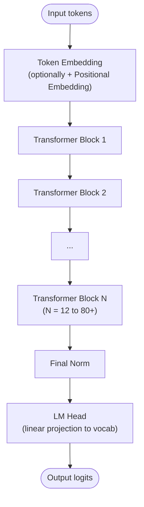
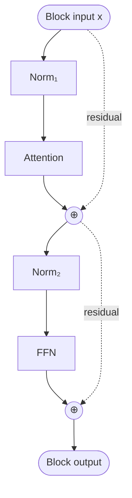

# LLM Architecture

## Definition

The structural design of a **Large Language Model** — the layered computation that maps a sequence of input tokens to a probability distribution over next tokens. Every modern LLM (GPT-2 in 2019 through DeepSeek-V4 in 2026) shares the **same skeleton**:

Each **Transformer Block** is:

**What changes between models is not the skeleton — it's every component inside it.** The 2019 → 2026 architectural arc is the story of swapping each primitive for a better one.

## The primitive-by-primitive recipe diff

| Component | GPT-2 (2019) | Llama 3 (2024) | DeepSeek-V3 (2024) |
|---|---|---|---|
| Token embedding | learned, tied to LM head | learned, tied | learned, tied |
| Position encoding | learned absolute | [[Rotary Position Embeddings]] | RoPE |
| Norm type | [[Batch Normalization\|LayerNorm]] | [[RMSNorm]] | RMSNorm |
| Norm placement | pre-norm | pre-norm | pre-norm |
| Attention | [[Multi-Head Attention\|MHA]] | [[Grouped-Query Attention\|GQA]] | [[Multi-head Latent Attention\|MLA]] |
| FFN activation | GELU | [[SwiGLU]] | SwiGLU |
| FFN structure | dense | dense | sparse [[Mixture of Experts\|MoE]] (256 + 1 shared, top-8) |
| Block layout | sequential | sequential | sequential |
| Training stability | none added | none | [[Multi-Token Prediction\|MTP]] auxiliary loss |

Modern frontier additions (2024–2026) layered on this base:
- **[[Sliding Window Attention]]** — alternates local-window and global attention layers (Gemma 3/4, OLMo 3, GPT-OSS).
- **[[QK-Norm]]** — normalize Q and K projections before attention scoring (OLMo 2, Gemma 3/4, Qwen3).
- **[[NoPE]]** — drop positional encoding in selected layers (SmolLM3, Sarvam).
- **[[Linear Attention]]** — sub-quadratic alternative (Mamba, Gated DeltaNet, Lightning Attention).
- **Hybrid architectures** — mix transformer layers with [[State Space Models|SSM]] or linear-attention layers (Nemotron 3, Qwen3 Next, Kimi Linear).

## Architecture primitive pages (this wiki)

### Embedding & position
- [[Embeddings]] — token embedding mechanics
- [[Positional Encoding]] — overview and variants
- [[Rotary Position Embeddings]] — RoPE (the modern default)
- [[NoPE]] — No Position Embedding (selective)

### Normalization
- [[Batch Normalization]] — historical; rarely used in transformers
- LayerNorm (covered in [[Transformer Architecture Anatomy]])
- [[RMSNorm]] — modern transformer default
- [[QK-Norm]] — normalize attention projections

### Attention
- [[Attention Mechanism]] — overview
- [[Self-Attention]] — within-sequence variant
- [[Scaled Dot-Product Attention]] — primitive
- [[Multi-Head Attention]] — MHA
- [[Grouped-Query Attention]] — GQA
- [[Multi-head Latent Attention]] — MLA (DeepSeek's KV-compression)
- [[Sliding Window Attention]] — local-window attention
- [[Linear Attention]] — sub-quadratic alternatives
- [[FlashAttention]] — IO-aware exact-attention
- [[Paged Attention]] — serving-time memory layout

### FFN
- [[SwiGLU]] — modern gated FFN activation
- [[Mixture of Experts]] — sparse FFN (top-k expert routing)

### Block layout
- [[Parallel Attention and FFN]] — alternative arrangement
- [[Residual Connections]] — additive skip

### Training-time additions
- [[Multi-Token Prediction]] — auxiliary loss for richer gradient signal

### Alternative backbones
- [[State Space Models]] — non-attention family
- [[Mamba]] — selective state-space
- [[Vision Transformer]] — ViT-style for images
- [[Diffusion Transformer]] — DiT for generation

## Model family pages (this wiki)

### Historical anchor
- [[GPT-2]] — 2019; the canonical autoregressive LLM at scale

### Open-weight dense (2024–2026)
- [[Llama 3]] — Meta dense reference
- [[OLMo 2]], [[OLMo 3]] — Allen AI open-data
- [[Gemma 3]], [[Gemma 4]] — Google compact
- [[Qwen3]] — Alibaba broad family
- [[Mistral Small 3]] — Mistral modern dense
- [[Phi-4]] — Microsoft small-model
- [[Granite 4.1]] — IBM enterprise

### Open-weight MoE (2024–2026)
- [[Mixtral]] — first popular open MoE
- [[DeepSeek-V3]] — fine-grained MoE + MLA flagship
- [[Llama 4]] — Meta MoE multimodal flagship
- [[GPT-OSS]] — OpenAI's 2025 open-weight return
- [[Kimi K2]] — Moonshot 1T MoE
- [[GLM-4.5]], [[GLM-5]] — Zhipu MoE
- [[Grok 2.5]] — xAI MoE
- [[MiniMax-M2]] — agent-focused MoE
- [[Command A]] — Cohere flagship

### Non-transformer / hybrid
- [[xLSTM]] — recurrent mLSTM revival (non-transformer)
- [[Nemotron 3]] — NVIDIA Mamba-hybrid

## Cross-cutting syntheses

- [[Transformer Architecture Anatomy]] — deeper walkthrough of one model's block-by-block computation
- [[LLM Architecture Landscape 2026]] — comparative grid across all model families
- [[Sequence Modeling Evolution]] — RNN → CNN → Transformer → SSM revival
- [[Modality-as-Tokens]] — how the same skeleton extends to images, audio, video
- [[Reasoning Models Landscape]] — what RL post-training does on top of the base architecture

## Tokenizers (briefly)

Tokenization is upstream of architecture but consequential. The dominant choices:
- **BPE (Byte-Pair Encoding)** — GPT family, Llama family
- **SentencePiece + Unigram** — Mistral, Qwen, T5
- **Tiktoken** — OpenAI's BPE implementation; reused by many
- **Byte-level BPE** — handles arbitrary bytes (Llama)

See [[Tokenization]] for the dedicated page.

## Training paradigms (briefly)

What turns the architecture into a useful model:
- **Pretraining** — next-token prediction on web-scale text
- **Supervised fine-tuning** — instruction-response pairs
- **Preference optimization** — [[RLHF]], [[Direct Preference Optimization|DPO]], [[ORPO]], [[KTO]]
- **Reinforcement learning with verifiable rewards** — [[RLVR]]; produced [[DeepSeek-R1]]
- **Distillation** — turn a big model's outputs into a small model's training data

See [[LLM Alignment and Post-Training]] for the full synthesis.

## Connections

- [[Transformer]] — the foundational paper
- [[Transformer Architecture Anatomy]] — block-by-block deep dive
- [[LLM Architecture Landscape 2026]] — comparative grid synthesis
- [[Mixture of Experts]] — the dominant 2024–2026 FFN swap
- [[Modality-as-Tokens]] — adjacent multimodal convergence
- [[2026-05-28-raschka-llm-architecture-gallery]] — source for this hub

## Open Questions

- Will transformers fully cede to hybrids (Mamba+attention) at frontier scale, or will the transformer skeleton hold?
- Is there room for novel norm types beyond LayerNorm / RMSNorm / QK-Norm?
- What's the next attention variant after MLA and Sliding Window?
- Does early-fusion multimodal (image, audio, text tokens in one trunk) demand new architecture primitives, or does the existing recipe just scale?
