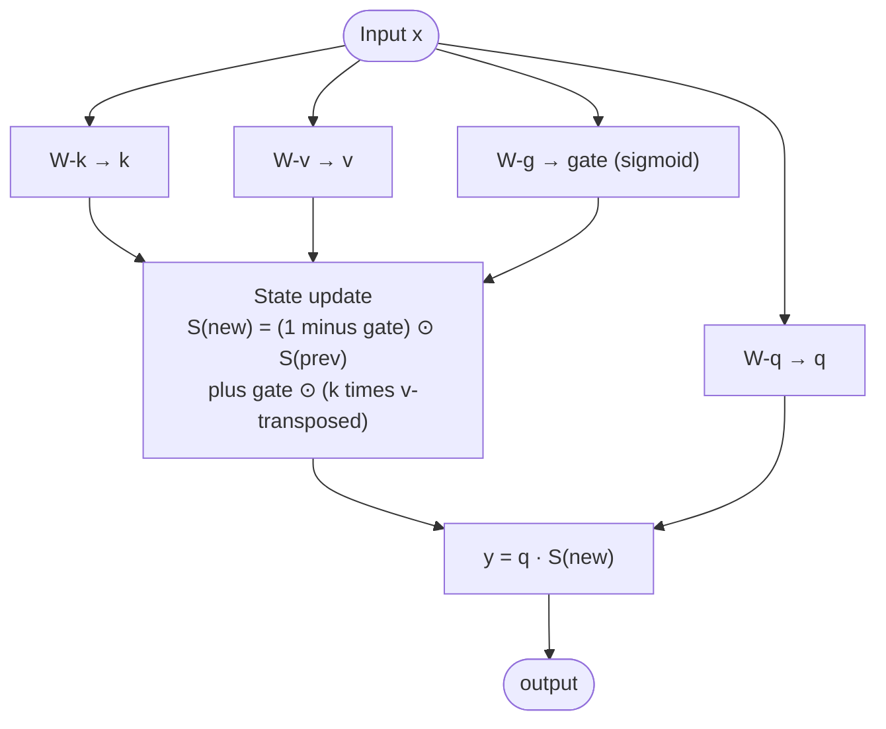

# Linear Attention

## Definition

**Linear Attention** is the family of attention mechanisms with **sub-quadratic time and memory complexity** in sequence length, achieved by reformulating attention so it can be computed without materializing the full $L \times L$ attention matrix. Linear-attention variants include **Performer**, **Linformer**, **Gated Linear Attention (GLA)**, **Gated DeltaNet**, **Lightning Attention**, and others — they're being adopted in 2025–2026 hybrid models (Qwen3 Next, Qwen3.5, Ling 2.5/2.6, Kimi Linear) as alternatives to or augmentations of standard attention.

## The reformulation

Standard attention (softmax):

$$\text{Attn}(Q, K, V) = \text{softmax}\left(\frac{QK^T}{\sqrt{d}}\right) V$$

The softmax requires materializing $QK^T$, an $L \times L$ matrix → O(L²) memory.

Linear attention replaces softmax with a **kernelized similarity**: $\text{softmax}(QK^T) \approx \phi(Q) \phi(K)^T$ for some feature map $\phi$. Then:

$$\text{Attn}(Q, K, V) = \phi(Q) \left( \phi(K)^T V \right)$$

The inner product $\phi(K)^T V$ is $d \times d$ — fixed size regardless of sequence length! Computing it incrementally gives **O(L · d²)** total cost — linear in sequence length.

In recurrent form, the running KV state $S_t = \sum_{i \leq t} \phi(k_i) v_i^T$ acts like a fixed-size cache; per-step inference is $O(d^2)$ regardless of position.

## Variants compared

| Variant | Feature map / mechanism | Notes |
|---|---|---|
| **Performer** (Choromanski 2020) | Random feature approximation of softmax | First widely-cited; not used much in 2026 |
| **Linformer** (Wang 2020) | Low-rank projection of K, V | Fixed projection; non-causal |
| **Linear Attention** (Katharopoulos 2020) | $\phi(x) = \text{elu}(x) + 1$ | Simple kernel; quality gap |
| **Retentive Networks (RetNet)** (Microsoft 2023) | Decay-modulated linear attention | Combines parallel + recurrent + chunked |
| **GLA (Gated Linear Attention)** | Per-head learnable decay gates | Closes quality gap with softmax attention |
| **Gated DeltaNet** | Generalized delta rule; gated updates | Used in Qwen3 Next, Qwen3.5 |
| **Lightning Attention** | I/O-aware fused kernel (linear attn) | Used in MiniMax, Ling |
| **Mamba / Mamba-2** | Selective state-space (related family) | [[Mamba]] |

## Why linear attention is back in 2025–2026

The first wave of linear attention (Performer, Linformer, 2020–2021) underperformed softmax attention at scale and was abandoned. The 2024–2025 wave (GLA, DeltaNet, Lightning) closed the gap through:

- **Gating** — input-dependent decay matches the expressivity of softmax.
- **Hardware-aware kernels** — Lightning Attention uses FlashAttention-style tiling.
- **Hybrid composition** — paired with standard attention layers, not used alone.

## Hybrid architectures using linear attention

| Model | Year | Recipe |
|---|---|---|
| **Qwen3 Next (80B-A3B)** | 2025-09 | Gated DeltaNet + Gated Attention |
| **Kimi Linear (48B-A3B)** | 2025-10 | Linear attention + [[Multi-head Latent Attention\|MLA]] |
| **Ling 2.5 / 2.6 (1T)** | 2026-02–04 | Lightning Attention + MLA |
| **Qwen3.5 (397B)** | 2026-02 | Gated DeltaNet + Gated Attention |
| **Qwen3.6 (35B-A3B)** | 2026 | Sparse MoE + Gated DeltaNet |

The common pattern: **alternating layers** of linear attention and full / latent attention. Linear-attention layers handle bulk processing; full-attention layers handle hard retrieval and in-context learning.

## Relationship to State Space Models

Mamba-2's **State-Space Duality** result shows that selective SSMs and certain gated linear attention variants are **mathematically equivalent** — they're two formulations of the same computation.

This unification means "linear attention vs SSM" is increasingly a notational difference. The active research question is: which formulation has the best hardware kernels?

## Block diagram (Gated DeltaNet sketch)

The state $S_t$ has fixed size — gate $g_t$ controls how much to update vs forget per step.

## Trade-offs

| Aspect | Linear Attention | Softmax Attention |
|---|---|---|
| Time complexity | O(L · d²) | O(L² · d) |
| Memory | O(d²) state + O(L · d) | O(L²) attention map |
| Long context (1M+) | Practical | Infeasible |
| In-context learning | Weaker (improving with gating) | Strong |
| Hard retrieval | Weaker | Strong |
| Hybrid composition | Often paired with softmax | Standalone |

## Connections

- [[Attention Mechanism]] — broader topic
- [[State Space Models]] — related family (often equivalent)
- [[Mamba]] — selective SSM, dual to gated linear attention
- [[FlashAttention]] — Lightning Attention is the linear-attention analog
- [[Multi-head Latent Attention]] — paired in modern hybrids
- [[Sliding Window Attention]] — alternative local-attention strategy
- [[LLM Architecture]] — hub
- [[Sequence Modeling Evolution]] — synthesis
- [[2026-05-28-raschka-llm-architecture-gallery]] — source

## Open Questions

- Best linear attention variant for frontier scale — Gated DeltaNet vs Lightning vs Mamba-2.
- Optimal mixing ratio with softmax / MLA in hybrid stacks.
- Can a pure linear-attention model (no softmax/full-attention islands) match transformer quality at 1T+ scale?
