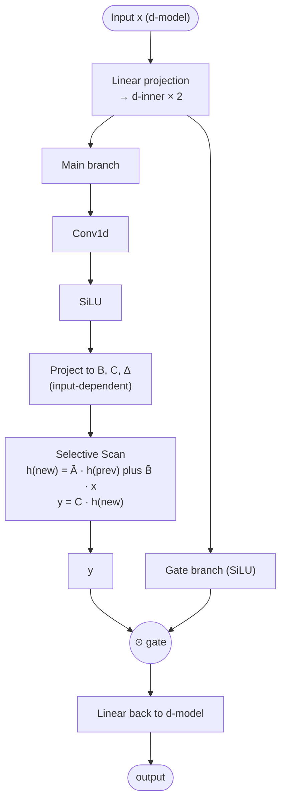

# Mamba

## Definition

**Mamba** (Gu & Dao, 2023, "Mamba: Linear-Time Sequence Modeling with Selective State Spaces") is the **selective state-space model** that made [[State Space Models|SSMs]] competitive with transformers for language modeling. The key innovation: making the state-space dynamics matrices **input-dependent**, so the model can selectively retain or forget information based on content. **Mamba-2** (2024) refined the design and unified SSMs with attention under the "State-Space Duality" framework.

Mamba is the SSM the industry actually deploys — Cartesia productized it for speech (Sonic), Nemotron 3 uses Mamba-2 as the dominant trunk, Jamba/Samba/Zamba hybridize it with transformer attention.

## Mamba vs S4

[[State Space Models|S4]]'s state-space dynamics matrices $A, B, C$ are *fixed* (don't depend on input). This made S4 efficient but limited — it couldn't gate "which token to remember" based on the token's content.

Mamba makes $B$, $C$, and the time-step $\Delta$ **input-dependent**:

$$B_t = \text{Linear}_B(x_t), \quad C_t = \text{Linear}_C(x_t), \quad \Delta_t = \text{softplus}(\text{Linear}_\Delta(x_t))$$

Then:

$$\bar{A}_t = \exp(\Delta_t A), \quad \bar{B}_t = \Delta_t B_t$$
$$h_t = \bar{A}_t h_{t-1} + \bar{B}_t x_t$$
$$y_t = C_t h_t$$

This breaks the global-convolution formulation of S4 — but Mamba's contribution is a **hardware-aware parallel scan kernel** that keeps training fast despite the input-dependence.

## Block diagram

A Mamba block replaces the attention + FFN in a transformer block. Norm and residuals remain similar.

## Mamba-2

Mamba-2 (Dao & Gu, 2024) introduces **State-Space Duality (SSD)** — a framework showing that SSMs and certain attention variants are mathematically related.

Key changes vs Mamba-1:
- **Larger state size** (HEAD-style structure with smaller hidden dim per head, more heads).
- **Simpler kernel** — runs entirely as matrix multiplications, friendly to tensor cores.
- **2–8× faster** training than Mamba-1.

This is the variant in [[Nemotron 3]].

## Why Mamba works

- **Selectivity** — the model can compress what's irrelevant and retain what matters per-token.
- **Linear scaling** — O(L) for inference, vs O(L²) attention.
- **Constant inference state** — single hidden vector per layer regardless of sequence length.
- **Hardware-aware** — kernel-fused selective scan keeps training-time parallelism.

## Where Mamba appears

| Model | Year | Mamba role |
|---|---|---|
| **Mamba** (original) | 2023 | Pure Mamba LM (research) |
| **Jamba** (AI21) | 2024 | Mamba + transformer hybrid |
| **Samba** (Microsoft) | 2024 | Mamba + sliding-window attention |
| **Zamba** (Zyphra) | 2024 | Mamba + shared-attention transformer |
| **Cartesia Sonic** | 2024 | Productized for speech TTS |
| **Mamba-2** | 2024 | Refined architecture |
| **[[Nemotron 3]] Nano/Super** | 2025–2026 | Dominant Mamba-2 trunk + transformer islands + MoE |

## Failure modes

- **In-context learning weakness** — Mamba doesn't pick up from few-shot examples as easily as transformers. Hybrids mitigate.
- **Hard retrieval** — looking up specific tokens in a long context is harder for SSMs.
- **Calibration** — under-explored; less mature than transformers.

## Connections

- [[State Space Models]] — broader family
- [[Linear Attention]] — closely related (Mamba-2 is dual to certain linear attention)
- [[Sequence Modeling Evolution]] — synthesis
- [[Nemotron 3]] — flagship Mamba-2 hybrid
- [[Cartesia]] — productized Mamba for speech
- [[Transformer]] — what Mamba partially replaces
- [[LLM Architecture]] — hub
- [[2026-05-28-raschka-llm-architecture-gallery]] — source

## Open Questions

- Mamba-3 — what's next architecturally?
- Optimal hybrid ratio (Mamba layers : transformer layers) at frontier scale.
- Mamba for multimodal — does it scale to image/audio tokens as cleanly as transformers?
