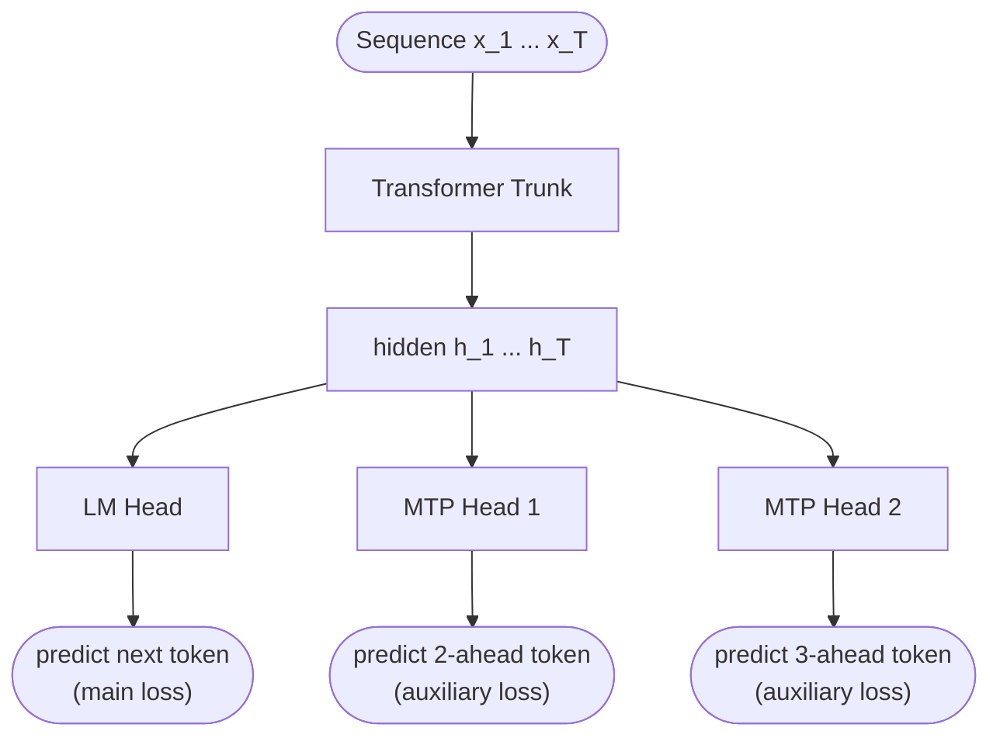

# Multi-Token Prediction

## Definition

**Multi-Token Prediction (MTP)** is a training-time auxiliary objective that asks a transformer to predict not just the *next* token but the next $k$ tokens jointly. Introduced by Gloeckle et al. (Meta, ICML 2024) and popularized at scale by **DeepSeek-V3** (Dec 2024), MTP improves training signal density and acts as a regularizer; in some configurations the predicted lookahead tokens can also be used at inference time for **speculative decoding**.

## The mechanism

Standard LM training: at position $t$, predict token $x_{t+1}$ using $x_{\leq t}$:

$$\mathcal{L}_{\text{LM}} = -\sum_t \log P(x_{t+1} \mid x_{\leq t})$$

MTP adds prediction heads for further-ahead tokens. For a model with $D$ MTP heads:

$$\mathcal{L}_{\text{MTP}} = -\sum_t \sum_{d=1}^{D} \lambda_d \log P(x_{t+1+d} \mid x_{\leq t}, \text{head}_d)$$

Each MTP head shares the trunk's representations but uses a separate small predictor module (typically `Norm → small transformer block → LM head`).

DeepSeek-V3 uses **D = 1** (one extra MTP head predicting $x_{t+2}$). Step 3.5 Flash uses **MTP-3** (heads for $x_{t+2}, x_{t+3}, x_{t+4}$). Nemotron 3 Super uses MTP at scale.

## Block diagram

At training time, all heads contribute to the loss. At inference, the main next-token head produces the output sequence; MTP heads can optionally be used for speculative decoding.

## Why MTP helps

- **Denser training signal** — each position contributes $D+1$ gradient signals instead of 1.
- **Forces longer-range planning** — the trunk must encode enough information for two-token-ahead prediction, not just one.
- **Regularization** — multi-head loss prevents the trunk from collapsing to short-range cues only.
- **Speculative decoding ready** — heads predicting $x_{t+2}, x_{t+3}$ can propose draft tokens to be verified by the main head.

## Speculative decoding mode

At inference, MTP-equipped models can use their auxiliary heads to propose multiple tokens per forward pass:

1. Main head predicts $x_{t+1}$.
2. MTP-1 head predicts $x_{t+2}$ in parallel.
3. Run a *verification* forward pass — does the trunk, given the proposed $x_{t+1}$, also predict $x_{t+2}$?
4. If yes, accept both; advance two positions in one decoding step.
5. If no, fall back to single-token decoding.

This gives 1.5–2× decoding speedup in practice.

## Where it appears

| Model | MTP |
|---|---|
| **DeepSeek-V3** | D=1 (auxiliary loss + speculative decoding ready) |
| DeepSeek-V3.2 | D=1 |
| DeepSeek-V4 | inherits |
| **Step 3.5 Flash** | D=3 |
| **Nemotron 3 Super** | MTP at scale |
| Most other 2024–2026 LLMs | None |

MTP is currently a DeepSeek-led practice; broader adoption is recent.

## Connections

- [[LLM Architecture]] — hub
- [[DeepSeek-V3]] — flagship MTP user
- [[DeepSeek-AI]] — originated the at-scale MTP recipe
- [[Mixture of Experts]] — paired innovation
- [[Multi-head Latent Attention]] — paired DeepSeek innovation
- [[2026-05-28-raschka-llm-architecture-gallery]] — source

## Open Questions

- Optimal D (number of MTP heads) at frontier scale.
- Does MTP help small (<1B) models or only at scale?
- Architectural variations on the MTP head (shared trunk position vs separate stack).
