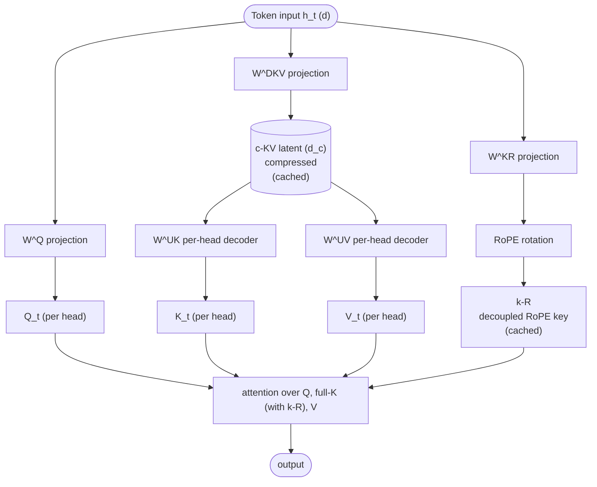

# Multi-head Latent Attention

## Definition

**Multi-head Latent Attention (MLA)** is an attention variant introduced in **DeepSeek-V2** (May 2024) and refined in [[DeepSeek-V3]] that **compresses the [[KV Cache]] by projecting keys and values through a low-rank latent space**. MLA achieves the quality of [[Multi-Head Attention|MHA]] with a KV cache roughly **10× smaller** than [[Grouped-Query Attention|GQA]] — a major serving-time win for long-context inference.

After DeepSeek released it, MLA spread quickly: Kimi K2, Mistral Large 3, GLM-5, Sarvam-105B, Ling, LongCat, and DeepSeek's own V3.2 and V4 all use MLA.

## The problem MLA solves

Standard MHA stores, for each token, full $K$ and $V$ matrices per head — KV cache size grows linearly with sequence length × layers × heads × head_dim. For long context (32K, 128K, 1M tokens), KV cache dominates inference memory.

GQA mitigates this by sharing K/V across groups of query heads (e.g., 32 Q heads share 8 K/V heads) — typically a 4× KV cache reduction with minor quality loss.

MLA goes further: instead of storing full K and V, **store only a low-rank latent vector per token**, and reconstruct K/V on the fly.

## The mechanism

For each token, compute a **compressed latent** $c_t^{KV} \in \mathbb{R}^{d_c}$ where $d_c \ll d$:

$$c_t^{KV} = W^{DKV} \cdot h_t$$

Store $c_t^{KV}$ in the cache (small).

At attention time, **reconstruct** keys and values per head:

$$K_t^{(i)} = W^{UK}_i \cdot c_t^{KV}, \quad V_t^{(i)} = W^{UV}_i \cdot c_t^{KV}$$

DeepSeek further uses **decoupled RoPE**: positional encoding is applied to a *separate* small key vector $k_t^R$ that bypasses the latent compression, so positions don't degrade under low-rank projection:

$$k_t^R = \text{RoPE}(W^{KR} \cdot h_t)$$

Final per-head key is the concatenation $[K_t^{(i)}, k_t^R]$.

## Block diagram

The **cache stores $c_t^{KV}$ and $k_t^R$** — total ~1/10 the size of full K/V per token compared to MHA.

## KV cache size compared

For a 7B-class model with 32 layers, 32 heads, head_dim 128, at 32K context (per token, per layer):

| Attention | KV size per token | 32K context total |
|---|---|---|
| MHA | 2 × 32 × 128 = 8192 floats | 16 GB (fp16) per sequence |
| GQA (8 KV heads) | 2 × 8 × 128 = 2048 | 4 GB |
| MQA (1 KV head) | 2 × 128 = 256 | 0.5 GB |
| **MLA** ($d_c = 512$) | 512 + 64 (decoupled key) ≈ 576 | **~1.1 GB** |

So MLA reaches near-MQA cache size with near-MHA quality — best of both.

## Why MLA didn't collapse to MQA

Naively projecting K/V through a single shared bottleneck would resemble MQA (1 KV head). MLA's trick is that the **up-projection $W^{UK}$ and $W^{UV}$ are per-head** — so each head reconstructs its own K/V from the shared latent, retaining MHA's per-head expressivity.

This is sometimes phrased as "compress at storage time, decompress at attention time, with per-head decoders."

## Adoption arc

| Model | Year | Attention |
|---|---|---|
| DeepSeek-V2 | 2024-05 | **MLA introduced** |
| DeepSeek-V3 | 2024-12 | MLA |
| Kimi K2 (1T) | 2025-07 | MLA |
| Mistral Large 3 | 2025-12 | MLA |
| DeepSeek-V3.2 | 2025-12 | MLA + sparse attention |
| Sarvam-105B | 2026-03 | MLA |
| Ling 2.5 | 2026-02 | Hybrid (Lightning Attention + MLA) |
| LongCat-Flash-Lite | 2026-01 | MLA |
| Kimi Linear | 2025-10 | Hybrid (linear attention + MLA) |
| DeepSeek-V4 | 2026-04 | CSA/HCA (next-gen compressed attention) |

## Trade-offs

| Aspect | Win | Loss |
|---|---|---|
| KV cache | ~10× smaller than MHA | None |
| Inference latency | Faster (less memory bandwidth) | Up-projection adds small compute |
| Training compute | Comparable to MHA | Slightly more complex backward pass |
| Implementation | More work than GQA | Fused kernels exist but newer |
| Quality | Matches MHA at scale | Reportedly worse at small models (<1B) |

## Connections

- [[Multi-Head Attention]] — what MLA compresses
- [[Grouped-Query Attention]] — predecessor compression scheme
- [[KV Cache]] — what MLA shrinks
- [[Rotary Position Embeddings]] — used in decoupled-RoPE branch
- [[FlashAttention]] — composes with MLA at attention time
- [[DeepSeek-V3]] — MLA's flagship deployment
- [[DeepSeek-AI]] — originated MLA
- [[LLM Architecture]] — hub
- [[2026-05-28-raschka-llm-architecture-gallery]], [[2026-05-28-mixture-of-experts-2026]] — sources

## Open Questions

- DeepSeek-V4's CSA/HCA (Compressed Sparse Attention / Hierarchical Compressed Attention) — successor to MLA?
- Why does MLA reportedly underperform GQA at <1B scale?
- Does MLA compose well with [[Linear Attention]] hybrids beyond Kimi Linear's pattern?
