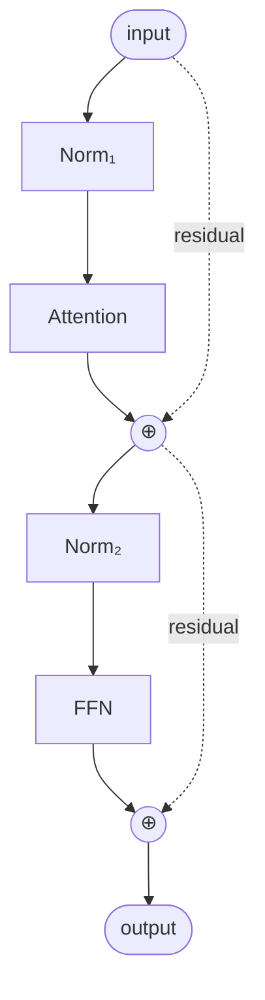
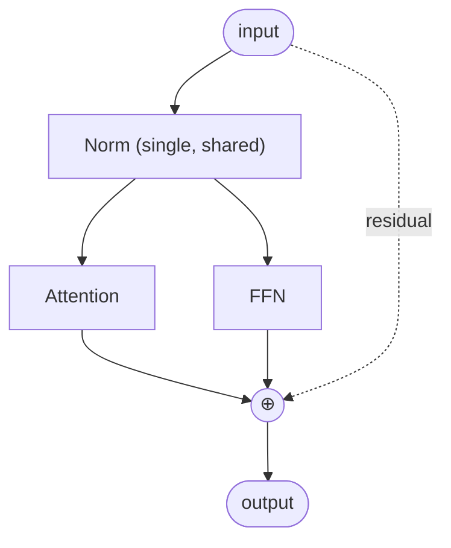

# Parallel Attention and FFN

## Definition

**Parallel Attention and FFN** (also called **Parallel Block** or **PALM-style block**) is a transformer-block layout where the attention and feed-forward sub-layers are computed **in parallel from the same normalized input** and their outputs are added together as a single residual, instead of running sequentially. This design was introduced in **PaLM** (Chowdhery et al. 2022) and adopted in **GPT-NeoX-20B**, **Falcon**, **Cohere's Tiny Aya**, and several other models — typically for training-throughput gains.

## Sequential (standard) vs parallel block

**Sequential** (standard, used in GPT-2, Llama, most modern LLMs):

**Parallel** (PaLM-style):

In the parallel block, only **one normalization** per block (not two), and the residual passes around both sub-layers as a single addition.

## Formula difference

Sequential:
$$h_1 = x + \text{Attn}(\text{Norm}(x))$$
$$h_2 = h_1 + \text{FFN}(\text{Norm}(h_1))$$

Parallel:
$$h = x + \text{Attn}(\text{Norm}(x)) + \text{FFN}(\text{Norm}(x))$$

The parallel layout sees the *same input* for both sub-layers, then sums.

## Why parallel blocks

- **Better training throughput** — attention and FFN can compute in parallel on hardware (e.g., on TPU pods).
- **Smaller activation memory** — one normalization output is reused.
- **Empirically similar quality** at scale (PaLM showed marginal differences vs sequential).

## Trade-offs

| Aspect | Sequential | Parallel |
|---|---|---|
| Throughput | Standard | Slightly better on TPU/GPU pods |
| Quality at scale | Reference | Comparable; sometimes slightly worse at small scale |
| Implementation complexity | Standard | Slightly more (must split projections cleverly) |
| Activation memory | Two norms | One norm |
| Pre-norm / post-norm choice | Independent | Pre-norm typical |

## Where it appears

| Model | Block layout |
|---|---|
| GPT-2 | Sequential |
| GPT-3 | Sequential |
| **PaLM** (2022) | **Parallel** (introduced this) |
| GPT-J / GPT-NeoX-20B | Parallel |
| Falcon | Parallel |
| Llama 1/2/3/4 | Sequential |
| Mistral / Mixtral | Sequential |
| Qwen / Qwen2 / Qwen3 | Sequential |
| Gemma 1/2/3/4 | Sequential |
| DeepSeek V2/V3/V4 | Sequential |
| **Cohere Tiny Aya** (2026) | **Parallel** |
| OLMo 1/2/3 | Sequential |
| Phi-3 / Phi-4 | Sequential |

Parallel blocks are a minority pattern — most 2024–2026 frontier LLMs use sequential. Cohere continues to use parallel in some of its models for training-efficiency reasons.

## Connections

- [[Transformer]] — the architecture parallel-blocks restructure
- [[Multi-Head Attention]] — one of the parallel branches
- [[SwiGLU]] — the other parallel branch (FFN)
- [[RMSNorm]] — the shared normalization
- [[Residual Connections]] — the additive merge
- [[LLM Architecture]] — hub
- [[Command A]], [[Tiny Aya]] — Cohere users of parallel blocks
- [[2026-05-28-raschka-llm-architecture-gallery]] — source

## Open Questions

- Does parallel-block training-throughput advantage persist on H100/H200/B200 hardware?
- Are there gains beyond throughput (e.g., gradient flow) we're missing?
- Why has the field overwhelmingly converged on sequential blocks despite parallel's release in PaLM?
