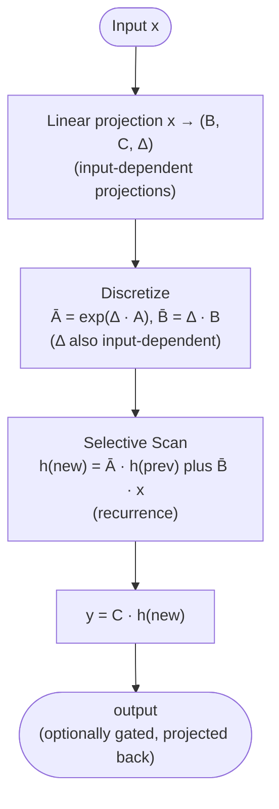

# State Space Models

## Definition

**State Space Models (SSMs)** are a family of sequence models based on continuous-time linear dynamical systems, discretized for use on token sequences. Unlike transformers, SSMs process sequences with a **recurrent computation** that has **linear time complexity** in sequence length (vs transformers' quadratic). The modern SSM revival began with **S4** (Gu et al., ICLR 2022) and culminated in **Mamba** (Gu & Dao, 2023) and **Mamba-2** (2024), which match or beat transformers on language modeling at long contexts.

The 2025–2026 frontier increasingly **hybridizes** SSMs with transformer attention layers ([[Nemotron 3]], Jamba, Samba), not replacing transformers entirely.

## The underlying dynamics

A continuous-time linear state-space system:

$$\frac{dh(t)}{dt} = A h(t) + B x(t)$$
$$y(t) = C h(t) + D x(t)$$

Where $x(t)$ is the input, $h(t)$ is the hidden state, and $A, B, C, D$ are matrices. Discretizing this over time steps gives:

$$h_t = \bar{A} h_{t-1} + \bar{B} x_t$$
$$y_t = C h_t + D x_t$$

This is **a linear RNN** — but with structured $\bar{A}$ matrices (HiPPO initialization in S4) that give it the expressive power of attention while keeping the recurrence linear.

## Why SSMs matter

- **Linear-time inference** — O(L) instead of attention's O(L²).
- **Linear-memory KV-cache-equivalent** — fixed-size hidden state per layer, not growing with sequence length.
- **Long-range modeling** — structured $A$ matrices retain information across very long contexts.
- **Parallelizable training** — the recurrence can be unrolled via parallel scans or convolutional formulations.

These properties make SSMs attractive for **very long context** (1M+ tokens) and **streaming inference**.

## SSM variants

| Model | Year | Key idea |
|---|---|---|
| **S4** | 2022 | Structured State Space; HiPPO matrix initialization |
| **S5** | 2022 | MIMO version of S4 |
| **GSS** | 2022 | Gated State Space |
| **H3** | 2023 | Hungry Hungry Hippos; multiplicative gating |
| **Mamba** | 2023 | Input-dependent (selective) state space; hardware-aware kernel |
| **Mamba-2** | 2024 | Structured State-Space Duality with attention |
| **GLA** | 2024 | Gated Linear Attention (related family) |
| **Gated DeltaNet** | 2025 | Used in Qwen3 Next, Qwen3.5 |

## Selective State Space (Mamba's innovation)

S4's $A$ matrix is fixed (data-independent). [[Mamba]]'s breakthrough was making $A$, $B$, $C$ **input-dependent** — the model selects what to remember based on the current token. This made SSMs competitive with transformers on standard language modeling.

The selectivity comes at a cost: input-dependent $\bar{A}$ breaks the global convolution formulation. Mamba's solution is a **hardware-aware parallel scan** kernel that retains training-time parallelism.

## Block diagram (Mamba-style SSM block)

Compare to a transformer block: instead of attention, an SSM block runs the selective scan. The rest (residuals, FFN, norm) is the same.

## Hybrid transformer-SSM architectures

Pure SSMs underperform transformers on certain tasks (in-context learning, hard retrieval). The 2024–2026 trend: **mix SSM layers with transformer layers**.

| Model | Year | Recipe |
|---|---|---|
| **Jamba** (AI21) | 2024 | Alternating Mamba + transformer layers |
| **Samba** (Microsoft) | 2024 | Mamba + sliding-window attention |
| **Zamba 1/2** (Zyphra) | 2024 | Mamba + shared-attention transformer |
| **[[Nemotron 3]] Nano/Super** | 2025–2026 | Mostly Mamba-2 + selective transformer + MoE |
| **Qwen3 Next** | 2025 | Gated DeltaNet + Gated Attention |
| **Kimi Linear** | 2025 | Linear attention (Gated DeltaNet-like) + MLA |
| **Ling 2.5 / 2.6** | 2026 | Lightning Attention + MLA |
| **Qwen3.5** | 2026 | Gated DeltaNet + Gated Attention |

The ratio of SSM-to-transformer layers varies — Nemotron 3 is mostly SSM with a few transformer layers; Jamba is roughly 50/50.

## When SSMs win

- **Very long context** — 1M+ tokens where transformer attention is infeasible.
- **Streaming / online inference** — constant memory per step.
- **Audio / time-series** — natural fit for continuous-time signals.

## When transformers still win

- **Strong in-context learning** — transformers learn from examples in the prompt better.
- **Hard retrieval / lookup** — attention's all-pairs interactions are hard to replicate.
- **Reasoning chains** — current evidence still favors transformers for chain-of-thought.

Hybrids try to capture both.

## Connections

- [[Mamba]] — flagship modern SSM
- [[Linear Attention]] — closely related sub-quadratic family
- [[Transformer]] — the architecture SSMs partially replace
- [[Sequence Modeling Evolution]] — synthesis on RNN → CNN → Transformer → SSM arc
- [[Nemotron 3]] — modern SSM-hybrid
- [[Cartesia]] — productized SSMs in speech (Sonic 3.5)
- [[LLM Architecture]] — hub
- [[2026-05-28-raschka-llm-architecture-gallery]] — source

## Open Questions

- Will pure SSMs ever beat transformers at frontier scale, or always need transformer islands?
- Optimal SSM-to-transformer ratio in hybrids.
- Best SSM variant for in-context learning (the standing weakness).
