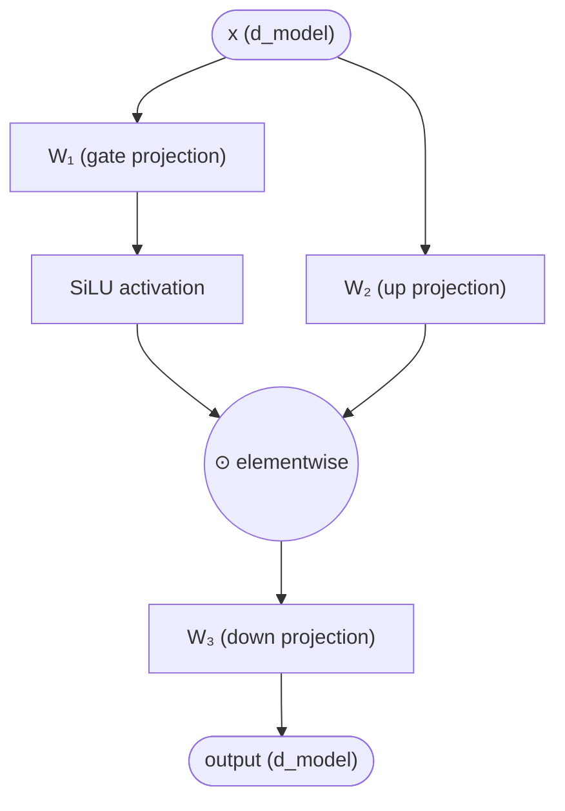

# SwiGLU

## Definition

**SwiGLU** (Shazeer 2020, "GLU Variants Improve Transformer") is a **gated** feed-forward (FFN) variant that replaces the standard `Linear → GELU → Linear` FFN with a multiplicative gate. It has become the **universal FFN activation in modern LLMs** — Llama, Mistral, Qwen, Gemma, DeepSeek, Phi, OLMo, GPT-OSS all use it.

## The formula

Standard transformer FFN (GPT-2 era):

$$\text{FFN}(x) = W_2 \cdot \text{GELU}(W_1 x)$$

SwiGLU FFN:

$$\text{SwiGLU}(x) = W_3 \cdot (\text{SiLU}(W_1 x) \odot W_2 x)$$

where SiLU (a.k.a. Swish): $\text{SiLU}(z) = z \cdot \sigma(z)$ with $\sigma$ the sigmoid.

Three projections — $W_1, W_2, W_3$ — instead of two. The gate $\text{SiLU}(W_1 x)$ modulates the linear projection $W_2 x$ multiplicatively before $W_3$ projects back to model dimension.

```python
def swiglu(x, w1, w2, w3):
    return (F.silu(x @ w1) * (x @ w2)) @ w3
```

## Block diagram



Internal dimension is typically $\frac{2}{3} \cdot 4 d$ (the 4× expansion of standard FFN, scaled by $\frac{2}{3}$ to keep parameter count roughly equal to a standard GELU FFN despite the extra projection).

## Why it replaced GELU

- **Better quality** at the same parameter and compute budget — consistent improvement on language modeling benchmarks.
- **Gated structure** lets the FFN selectively pass information, similar to LSTM gates.
- **Hardware-friendly** — the three matmuls fuse cleanly.

## GLU variants compared

Shazeer 2020 evaluated several gated variants:

| Variant | Gate activation | Result |
|---|---|---|
| GLU | sigmoid | OK |
| Bilinear | identity | OK |
| ReGLU | ReLU | better |
| GEGLU | GELU | better |
| **SwiGLU** | SiLU/Swish | **best** |

SwiGLU was the empirical winner and the field has converged on it.

## Where it appears

| Model | FFN |
|---|---|
| GPT-2/3 | GELU FFN |
| **PaLM** (2022) | **SwiGLU** (first major adopter) |
| **Llama 1** (2023) | **SwiGLU** |
| Llama 2/3/3.2/4 | SwiGLU |
| Mistral 7B, Mixtral | SwiGLU |
| Qwen, Qwen2, Qwen3 | SwiGLU |
| Gemma 1/2/3/4 | SwiGLU (sometimes GeGLU in older Gemma) |
| DeepSeek V2/V3/V4 | SwiGLU |
| Phi-3 / Phi-4 | SwiGLU |
| OLMo 1/2/3 | SwiGLU |

## Inside MoE

In Mixture-of-Experts models, **each expert is itself a SwiGLU FFN**. [[DeepSeek-V3]]'s 256 routed experts + 1 shared expert are all SwiGLU. The gate-then-multiply structure scales naturally to the expert setting.

## Connections

- [[Transformer]] — the architecture SwiGLU sits inside
- [[LLM Architecture]] — hub
- [[Mixture of Experts]] — each expert is a SwiGLU FFN
- [[RMSNorm]] — paired norm in modern recipe
- [[Llama 3]], [[Qwen3]], [[DeepSeek-V3]], [[Gemma 3]] — all use SwiGLU
- [[2026-05-28-raschka-llm-architecture-gallery]] — source

## Open Questions

- Is there a 2026-era FFN beyond SwiGLU worth the swap? (No leading candidate yet.)
- How does SwiGLU compose with [[Linear Attention]] layers in hybrid architectures?
