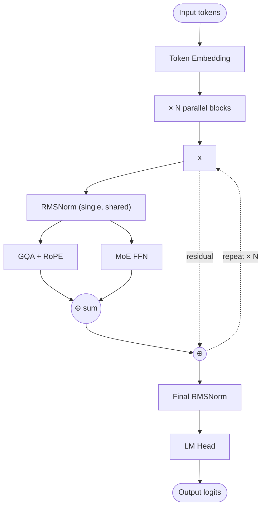

# Command A — Architecture

## Identity

Command A+ (**Cohere, 2026**) is Cohere's flagship open-weight LLM. 218B total / 25B active sparse MoE. Architecturally distinctive for using **[[Parallel Attention and FFN]] blocks** — Cohere is one of the few labs still championing PaLM-style parallel blocks. Cohere's smaller **Tiny Aya (3.35B)** also uses parallel blocks with sliding-window attention.

| Spec | Command A+ | Tiny Aya |
|---|---|---|
| Released | 2026 | 2026-02-13 |
| Organization | [[Cohere]] |
| Total params | 218B | 3.35B |
| Active params | 25B | 3.35B |
| Block layout | **Parallel attention + FFN** | **Parallel** |
| Attention | likely GQA | GQA |
| Window pattern | global | 3 SWA : 1 Global |
| FFN | Sparse MoE | SwiGLU |
| License | open weights |

## Block diagram (parallel block, Cohere style)

Each block computes attention and FFN **from the same normalized input** and sums their outputs. Only one normalization per block (not two).

## Recipe summary

| Component | Command A+ |
|---|---|
| Block layout | **Parallel** (rare in 2026) |
| Attention | GQA + RoPE |
| FFN | Sparse MoE |
| Norm | RMSNorm |
| Norm placement | Pre-norm, single per block |
| Sparsity | ~11.5% active |

## Why parallel blocks at Cohere

Cohere has retained the parallel-block design from its early models. The benefit: better training throughput on TPU/GPU pods, fewer normalization layers, simpler kernel fusion. The cost: marginally weaker quality at small scale (PaLM original ablations).

Most other 2024–2026 labs have moved to sequential blocks, making Cohere a notable architectural counterexample.

## Connections

- [[Parallel Attention and FFN]] — block layout
- [[Mixture of Experts]]
- [[Tiny Aya]] — smaller Cohere model with parallel blocks + SWA
- [[GQA]], [[RMSNorm]], [[RoPE]], [[SwiGLU]]
- [[Cohere]] — parent org
- [[LLM Architecture]] — hub
- [[LLM Architecture Landscape 2026]] — comparative synthesis
- [[2026-05-28-raschka-llm-architecture-gallery]] — source

## Open Questions

- Why has Cohere stuck with parallel blocks while the rest of the field moved to sequential?
- Does parallel-block throughput advantage hold at 200B+ scale on H200/B200?
