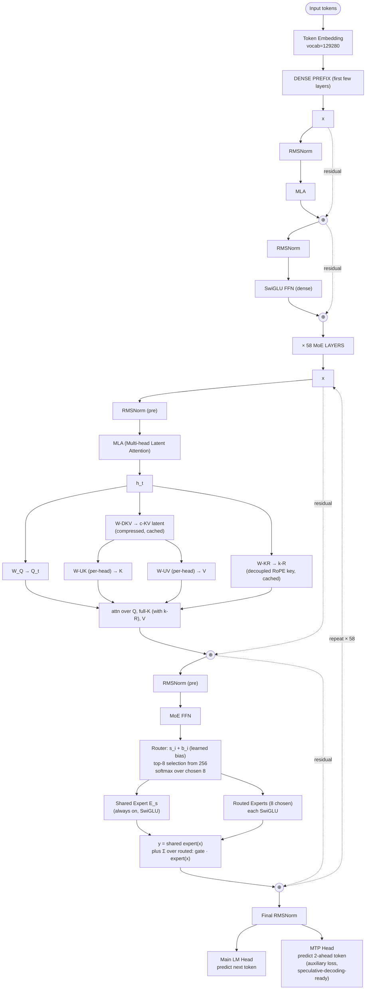

# DeepSeek-V3 — Architecture

## Identity

DeepSeek-V3 ([[DeepSeek-AI]], **December 26, 2024**) is the canonical 2024–2026 frontier open-weight architecture — **671B total / 37B active sparse MoE with [[Multi-head Latent Attention|MLA]], fine-grained experts, shared expert, aux-loss-free balancing, FP8 training, and [[Multi-Token Prediction|MTP]]**. This page covers the **architecture in depth** with full block diagrams; for the entity / org / variants / impact narrative, see [[DeepSeek-V3]] (entity page).

The architecture spread quickly: Kimi K2 (MLA + MoE), Mistral Large 3 (MLA + MoE), GLM-5 (MLA + sparse attention), Sarvam-105B (MLA), LongCat (MLA), Ling (MLA + linear attention) — all draw from this recipe.

| Spec | DeepSeek-V3 |
|---|---|
| Released | 2024-12-26 |
| Total params | 671B |
| Active params per token | 37B (5.5%) |
| Layers | 61 |
| Hidden dim | 7168 |
| Attention | [[Multi-head Latent Attention\|MLA]] |
| FFN | Sparse [[Mixture of Experts\|MoE]] |
| Experts per layer | 256 routed + 1 shared |
| Routing | top-8 of 256 |
| Norm | [[RMSNorm]] pre-norm |
| QK-Norm | No |
| Position | [[Rotary Position Embeddings\|RoPE]] (decoupled in MLA) |
| FFN activation | [[SwiGLU]] |
| Auxiliary loss | aux-loss-free bias balancing |
| Auxiliary objective | [[Multi-Token Prediction\|MTP]] (D=1) |
| Training precision | **FP8** |
| Context | 128K |
| License | MIT |

## Block diagram

## The DeepSeek-V3 distinctive innovations

### 1. MLA (Multi-head Latent Attention)

Compresses K, V via low-rank latent projection + per-head decoders. KV cache ~10× smaller than MHA. Decoupled RoPE keeps positional encoding outside the compression. See [[Multi-head Latent Attention]] for the full mechanism.

### 2. Fine-grained MoE with shared expert

256 small routed experts (instead of e.g. 8 large like Mixtral) + 1 always-active shared expert. Smaller experts can specialize more finely; the shared expert captures universal patterns and frees routed experts for specialization. Top-8 routing gives $\binom{256}{8} \approx 4 \times 10^{14}$ possible combinations.

### 3. Auxiliary-loss-free load balancing

Per-expert learnable biases adjust based on usage statistics — no auxiliary balance loss in the gradient. See [[Mixture of Experts]] for the formula. Cleaner training, no quality/balance tradeoff.

### 4. Node-limited routing

Limits cluster nodes a token's experts can span. Reduces cross-GPU all-to-all communication at scale.

### 5. FP8 training

First major open MoE trained natively in FP8 precision. Halves memory and compute vs bf16; required careful per-tensor scaling to maintain stability.

### 6. Multi-Token Prediction (MTP)

Auxiliary head predicts $x_{t+2}$ during training (D=1). Denser gradient signal; speculative-decoding-ready at inference.

## Recipe diff vs GPT-2

| Component | GPT-2 (2019) | DeepSeek-V3 (2024) |
|---|---|---|
| Total params | 1.5B | 671B (~450× larger) |
| Active params | 1.5B (dense) | 37B (5.5% active) |
| Norm | LayerNorm | RMSNorm |
| Attention | MHA | **MLA** |
| FFN | dense GELU | sparse MoE SwiGLU |
| Position | learned absolute | RoPE (decoupled in MLA) |
| Vocab | 50257 | 129280 |
| Training precision | fp32/bf16 | **FP8** |
| Auxiliary loss | none | MTP |
| Balancing | n/a | aux-loss-free bias |

## Variants

| Variant | Year | Notes |
|---|---|---|
| DeepSeek-V3-Base | 2024-12 | Pretrained; substrate for R1 |
| DeepSeek-V3 (instruct) | 2024-12 | General-purpose |
| DeepSeek-V3.1 / V3.2 | 2025 | Iterative; V3.2 reaches 94.2% MMLU |
| DeepSeek-V3.2 + Sparse Attention | 2025-12 | + sparse attention pattern |
| [[DeepSeek-R1]] | 2025-01 | RL fine-tune of V3-Base |
| [[DeepSeek-VL2]] | 2024 | MoE applied to vision-language |
| DeepSeek-V4 Flash | 2026-04 | 284B / 13B, CSA/HCA compressed attention |
| DeepSeek-V4 Pro | 2026-04 | 1.6T / 49B, multimodal |

## Connections

- [[DeepSeek-V3]] (entity page) — identity / org / impact narrative
- [[Multi-head Latent Attention]] — DeepSeek's signature innovation
- [[Mixture of Experts]] — fine-grained + shared expert recipe
- [[Multi-Token Prediction]] — auxiliary objective
- [[RMSNorm]], [[SwiGLU]], [[Rotary Position Embeddings]]
- [[DeepSeek-AI]] — parent org
- [[DeepSeek-R1]] — reasoning fine-tune
- [[DeepSeek-VL2]] — VLM application
- [[Kimi K2]], [[GLM-5]], [[Mistral Small 3]] (Mistral Large 3 / Small 4) — descendants adopting MLA
- [[LLM Architecture]] — hub
- [[LLM Architecture Landscape 2026]] — comparative synthesis
- [[2026-05-28-raschka-llm-architecture-gallery]] — source
- [[2026-05-28-mixture-of-experts-2026]] — MoE source

## Open Questions

- DeepSeek-V4's CSA / HCA (Compressed Sparse Attention / Hierarchical Compressed Attention) — what improves vs MLA?
- Why DeepSeek doesn't use QK-Norm despite the rest of the field adopting it.
- Reproducing FP8 training stability at smaller labs.
