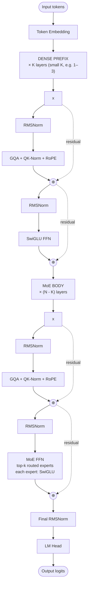

# GLM-4.5 — Architecture

## Identity

GLM-4.5 (**Zhipu AI, July 28, 2025**) is the flagship MoE model of Zhipu's GLM (General Language Model) series. 355B total with a sparse MoE FFN, [[Grouped-Query Attention|GQA]] with [[QK-Norm]], and a notable **dense prefix** — the first few layers are dense, then MoE kicks in for deeper layers. Released alongside **GLM-4.5-Air (106B)** as the smaller variant.

| Spec | GLM-4.5 | GLM-4.5-Air |
|---|---|---|
| Released | 2025-07-28 |
| Total params | 355B | 106B |
| Active params | ~11–12% | ~11.3% |
| Attention | [[Grouped-Query Attention\|GQA]] + [[QK-Norm]] |
| FFN | Sparse [[Mixture of Experts\|MoE]] with **dense prefix layers** |
| Norm | RMSNorm + QK-Norm pre-norm |
| Position | RoPE |
| License | open weights (Zhipu license) |
| Organization | Zhipu AI |

## Block diagram

## Why a dense prefix?

The first few layers process raw token-level features that benefit from full FFN capacity (no expert routing variance). After token features are mixed, switching to MoE for the bulk of layers captures the capacity-vs-compute MoE advantage where it matters most.

This pattern also appears in [[DeepSeek-V3]] (V3 has a small dense prefix), suggesting industry convergence.

## Recipe diff vs DeepSeek-V3

| Component | DeepSeek-V3 | GLM-4.5 |
|---|---|---|
| Total / Active | 671B / 37B (5.5%) | 355B / ~40B (~11%) |
| Attention | MLA | GQA + QK-Norm |
| QK-Norm | No | **Yes** |
| MoE recipe | 256 + 1 shared, top-8 | not disclosed |
| Dense prefix | small | yes (explicit) |
| Position | RoPE | RoPE |
| MTP | Yes | not disclosed |

## GLM-5 / GLM-5.1 successors

| Model | Year | Notes |
|---|---|---|
| **GLM-5 (744B)** | 2026-02 | Total scale up, **MLA + DeepSeek sparse attention** |
| **GLM-4.7 (355B)** | 2025-12 | Refined GLM-4.5; pre-MLA |
| **GLM-5.1 (744B)** | 2026-04 | Refined GLM-5 |

GLM-5 switches from GQA to **MLA**, following DeepSeek. And it adopts **DeepSeek sparse attention** (a variant introduced in DeepSeek-V3.2).

## Connections

- [[GLM-5]] — successor with MLA
- [[Grouped-Query Attention]], [[QK-Norm]], [[RMSNorm]], [[SwiGLU]], [[RoPE]]
- [[Mixture of Experts]]
- [[DeepSeek-V3]] — adjacent MoE recipe
- [[LLM Architecture]] — hub
- [[LLM Architecture Landscape 2026]] — comparative synthesis
- [[2026-05-28-raschka-llm-architecture-gallery]] — source

## Open Questions

- Why does GLM use QK-Norm where DeepSeek doesn't?
- Optimal dense-prefix depth (1, 2, 3 layers).
