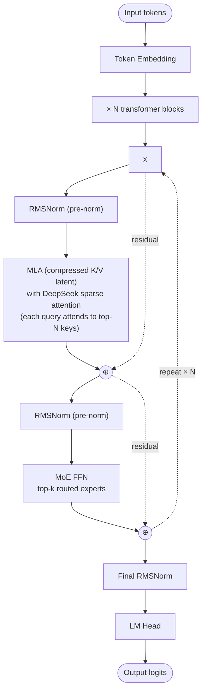

# GLM-5 — Architecture

## Identity

GLM-5 (**Zhipu AI, February 11, 2026**) is the successor to [[GLM-4.5]]. 744B total parameters, **adopts MLA + DeepSeek-style sparse attention**, abandoning GLM-4.5's GQA. Released alongside the **GLM-5.1 (744B)** refinement in April 2026.

| Spec | GLM-5 | GLM-5.1 |
|---|---|---|
| Released | 2026-02-11 | 2026-04-07 |
| Total params | 744B |
| Attention | [[Multi-head Latent Attention\|MLA]] + **DeepSeek sparse attention** |
| FFN | Sparse [[Mixture of Experts\|MoE]] |
| Norm | RMSNorm + QK-Norm |
| Position | RoPE (decoupled in MLA) |
| License | open weights |

## DeepSeek sparse attention

DeepSeek-V3.2 (Dec 2025) introduced a **sparse attention pattern** on top of MLA — only a subset of queries attend to keys via a learned selection, dramatically cutting attention compute at long context. GLM-5 adopts this.

The mechanism (approximate):
- Compute MLA as usual to get Q, K, V (via reconstruction from latent).
- For each query, **score candidate keys** with a lightweight router.
- Attend only to top-N keys per query (sparse attention pattern).

Result: attention complexity becomes near-linear in sequence length while preserving the long-range structure.

## Block diagram

## Recipe diff vs GLM-4.5

| Component | GLM-4.5 | GLM-5 |
|---|---|---|
| Total params | 355B | **744B** |
| Attention | GQA + QK-Norm | **MLA + sparse attention** |
| MoE | dense prefix + MoE body | dense prefix + MoE body |
| Position | RoPE | RoPE (decoupled in MLA) |

The shift from GQA to MLA aligns Zhipu with the DeepSeek-family architecture direction.

## Connections

- [[GLM-4.5]] — predecessor
- [[Multi-head Latent Attention]]
- [[Mixture of Experts]]
- [[QK-Norm]], [[RMSNorm]]
- [[DeepSeek-V3]] — origin of MLA and sparse attention adopted here
- [[LLM Architecture]] — hub
- [[LLM Architecture Landscape 2026]] — comparative synthesis
- [[2026-05-28-raschka-llm-architecture-gallery]] — source

## Open Questions

- Sparse-attention top-N parameter — what's optimal?
- Will the rest of the field follow Zhipu in adopting DeepSeek sparse attention?
