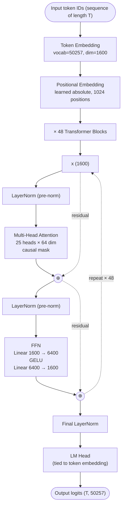

# GPT-2 — Architecture

## Identity

The **canonical historical anchor** for the entire modern LLM lineage. Released by [[OpenAI]] in **February 2019** in four sizes (124M, 355M, 774M, 1.5B). GPT-2's "1.5B XL" variant is the reference architecture against which every modern LLM should be compared — it's the **simplest possible "modern" decoder-only transformer**, with no later refinements (no RoPE, no RMSNorm, no SwiGLU, no GQA, no MoE).

| Spec | GPT-2 XL |
|---|---|
| Released | 2019-02-14 (full 1.5B in Nov 2019) |
| Organization | [[OpenAI]] |
| Parameters | 1.5B |
| Layers | 48 |
| Hidden dim | 1600 |
| Heads | 25 ([[Multi-Head Attention]]) |
| Head dim | 64 |
| FFN | 6400 (4× hidden) GELU |
| Context length | 1024 |
| Vocab | 50257 (byte-level BPE) |
| License | MIT |

## Block diagram

## The recipe (and what's missing vs modern)

GPT-2's full architectural choices:

| Component | GPT-2 | Modern (Llama 3) | Modern (DeepSeek-V3) |
|---|---|---|---|
| Position encoding | Learned absolute | [[Rotary Position Embeddings\|RoPE]] | RoPE (+ decoupled in MLA) |
| Normalization type | [[Batch Normalization\|LayerNorm]] | [[RMSNorm]] | RMSNorm |
| Normalization placement | Pre-norm | Pre-norm | Pre-norm |
| Attention type | [[Multi-Head Attention\|MHA]] | [[Grouped-Query Attention\|GQA]] | [[Multi-head Latent Attention\|MLA]] |
| FFN activation | GELU | [[SwiGLU]] | SwiGLU |
| FFN sparsity | Dense | Dense | Sparse [[Mixture of Experts\|MoE]] (256+1, top-8) |
| FFN expansion | 4× | ~2.7× (SwiGLU adjusted) | per-expert smaller |
| Block layout | Sequential | Sequential | Sequential |
| QK-Norm | No | No | No |
| Sliding window | No | No | No |
| MTP | No | No | Yes |
| Vocab | 50257 BPE | 128256 BPE | 129280 BPE |

## What GPT-2 still does right

Despite being 7 years old, GPT-2 already commits to:
- **Decoder-only autoregressive** — the dominant LLM paradigm today
- **Byte-level BPE tokenizer** — Llama, Mistral, Qwen still use BPE descendants
- **Pre-norm** — modern default
- **Weight tying** between token embedding and LM head — modern default
- **Residual + LayerNorm sandwich** — the unchanged block structure
- **No biases on most projections** in larger variants — modern default

The 2019 → 2026 architectural arc is largely **component swaps**, not a rethink of the skeleton.

## Why we still teach GPT-2

- **Minimal working transformer LM** — fits clearly in one diagram.
- **No "modern complications"** (RoPE, GQA, MoE) — easier to study core attention + FFN.
- **Open code, open weights** — the OpenAI 2019 release made the field reproducible.
- **Andrej Karpathy's nanoGPT** trains and inferences GPT-2 in ~300 lines of PyTorch — the canonical from-scratch reference implementation.

## Connections

### Components
- [[Multi-Head Attention]], [[Scaled Dot-Product Attention]], [[Self-Attention]]
- [[Positional Encoding]] (learned absolute variant)
- [[Batch Normalization]] (LayerNorm section)
- [[Embeddings]] (weight-tied embedding pattern)
- [[Residual Connections]]

### Lineage
- [[Transformer]] — the 2017 paper GPT-2 directly extends (decoder-only)
- [[Llama 3]] — the modern dense reference that GPT-2 maps to
- [[LLM Architecture]] — hub
- [[Transformer Architecture Anatomy]] — synthesis on block-by-block primitives
- [[LLM Architecture Landscape 2026]] — comparative synthesis

### Organization
- [[OpenAI]]

### Source
- [[2026-05-28-raschka-llm-architecture-gallery]]

## Open Questions

- Would GPT-2 with all the modern swaps (RoPE, RMSNorm, SwiGLU, GQA) match Llama 3 at the same scale, holding training data constant?
- What's the actual contribution of architecture vs data vs scale to the 2019→2026 quality jump?
