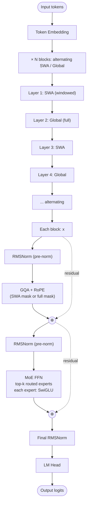

# GPT-OSS — Architecture

## Identity

GPT-OSS (**OpenAI, August 4, 2025**) is OpenAI's **return to open weights** after a 6-year closed-model run (the last open OpenAI release was GPT-2 in 2019). Released in two sizes: **GPT-OSS-20B** and **GPT-OSS-120B**, both **Sparse [[Mixture of Experts|MoE]]** with **alternating Sliding-Window / Global attention**.

| Spec | GPT-OSS 20B | GPT-OSS 120B |
|---|---|---|
| Released | 2025-08-04 |
| Organization | [[OpenAI]] |
| Total params | 20B | 120B |
| Active params | small fraction (MoE) |
| Attention | [[Grouped-Query Attention\|GQA]] |
| FFN | Sparse [[Mixture of Experts\|MoE]] (SwiGLU experts) |
| Norm | RMSNorm |
| Norm placement | Pre-norm |
| Window pattern | **Alternating SWA / Global** |
| Position | RoPE |
| License | Apache 2.0 |

## Block diagram

## Architectural distinctives

- **Alternating SWA / Global** — 1:1 alternation (vs Gemma 3's 5:1). Heavier on global attention than other window-based models.
- **Sparse MoE** at the FFN — both 20B and 120B variants.
- **GQA** for attention compression.
- **No QK-Norm** — OpenAI did not adopt the OLMo 2 / Gemma 3 norm.

## Why GPT-OSS matters

- **OpenAI's first open-weights LLM since GPT-2** — restores OpenAI to the open-weight ecosystem.
- **Apache 2.0 license** — fully permissive.
- **Validates MoE + SWA at OpenAI scale** — externally confirms OpenAI's frontier closed models likely use similar designs.
- **Reference for the modern OpenAI architecture recipe** as understood publicly.

## Recipe diff vs DeepSeek-V3

| Component | DeepSeek-V3 | GPT-OSS 120B |
|---|---|---|
| Attention | MLA | GQA |
| FFN | Fine-grained MoE (256 + 1 shared, top-8) | MoE (fewer experts, no public detail on shared) |
| Window | Global only | **Alternating SWA / Global** |
| Norm | RMSNorm | RMSNorm |
| QK-Norm | No | No |
| Position | RoPE (decoupled in MLA) | RoPE |
| Aux loss-free balancing | Yes | Not disclosed |
| MTP | Yes | Not disclosed |

## Connections

- [[OpenAI]] — parent org
- [[GPT-2]] — historical ancestor (last open OpenAI model before GPT-OSS)
- [[Mixture of Experts]] — sparsity strategy
- [[Sliding Window Attention]] — windowing strategy
- [[Grouped-Query Attention]], [[RMSNorm]], [[SwiGLU]], [[RoPE]]
- [[LLM Architecture]] — hub
- [[LLM Architecture Landscape 2026]] — comparative synthesis
- [[2026-05-28-raschka-llm-architecture-gallery]] — source

## Open Questions

- Will OpenAI continue open releases at frontier scale?
- The MoE configuration (expert count, top-k, shared expert) is partially undisclosed — does it match DeepSeek's recipe?
