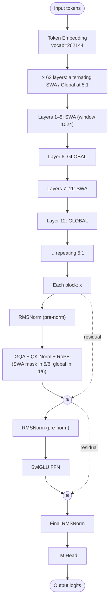

# Gemma 3 — Architecture

## Identity

Gemma 3 (Google DeepMind, **March 11, 2025**) is Google's compact open-weight LLM family — sizes 1B, 4B, 12B, **27B**, plus a 270M micro variant (Aug 2025). Architecturally distinguished by **5:1 sliding-window-to-global attention** alternation, [[QK-Norm]], and high attention head count.

| Spec | Gemma 3 27B | Gemma 3 270M |
|---|---|---|
| Released | 2025-03-11 | 2025-08-14 |
| Organization | [[Google DeepMind]] |
| Parameters | 27B | 270M |
| Attention | [[Grouped-Query Attention\|GQA]] | [[Multi-Head Attention\|MQA]] (1 KV head) |
| Norm | RMSNorm + [[QK-Norm]] |
| Norm placement | Pre-norm |
| Window pattern | **5 SWA : 1 Global** |
| SWA window | 1024 |
| Position | RoPE |
| FFN | SwiGLU |
| Vocab | 262144 (Gemma's expanded tokenizer) |
| Context | 128K |
| License | Gemma license (permissive commercial) |

## Block diagram (27B)

## Recipe diff vs Llama 3

| Component | Llama 3 8B | Gemma 3 27B |
|---|---|---|
| Vocab | 128K | 262K (much larger; multilingual focus) |
| QK-Norm | No | **Yes** |
| Window pattern | All global | **5 SWA : 1 Global** |
| SWA window | n/a | 1024 |
| Norm | RMSNorm pre-norm | RMSNorm + QK-Norm pre-norm |
| FFN | SwiGLU | SwiGLU |
| Position | RoPE | RoPE |
| Attention | GQA 4:1 | GQA |

## Gemma 3 270M (compact variant)

The 270M is architecturally interesting:
- **Multi-Query Attention** (1 KV head) — extreme KV cache compression.
- Same QK-Norm + 5:1 SWA/global pattern.
- Optimized for edge / on-device.

## Why Gemma 3's recipe matters

- **Validated 5:1 SWA/global** at meaningful scale — became a common ratio.
- **Pioneered QK-Norm in a frontier-class open release** (alongside OLMo 2).
- **262K vocab** — strong multilingual encoding, especially for Japanese, Korean, Chinese.
- **Compact-model family** (1B/4B/12B/27B/270M) — well-suited for on-device.

## Connections

- [[Sliding Window Attention]]
- [[QK-Norm]]
- [[RMSNorm]], [[SwiGLU]], [[Rotary Position Embeddings]], [[Grouped-Query Attention]]
- [[Gemma 4]] — successor
- [[Google DeepMind]]
- [[LLM Architecture]] — hub
- [[LLM Architecture Landscape 2026]] — comparative synthesis
- [[2026-05-28-raschka-llm-architecture-gallery]] — source

## Open Questions

- Optimal SWA window — Gemma 3's 1024 vs Mistral's 4096.
- 5:1 ratio is empirical; what's the theoretical justification?
