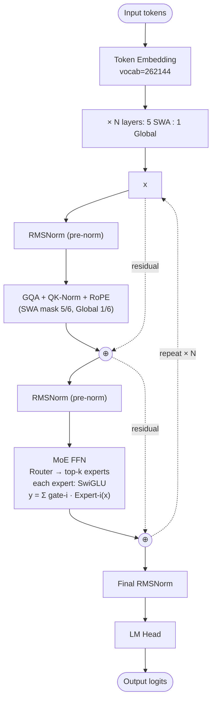

# Gemma 4 — Architecture

## Identity

Gemma 4 (Google DeepMind, **April 2, 2026**) is Google's 2026 open-weight family — dense (31B), MoE (26B-A4B), and edge variants (E2B, E4B) with KV-sharing. Continues Gemma 3's 5:1 SWA/global pattern; adds **MoE at the mid-size** and **KV sharing** for edge variants.

| Spec | Gemma 4 31B | Gemma 4 26B-A4B | Gemma 4 E2B | Gemma 4 E4B |
|---|---|---|---|---|
| Released | 2026-04-02 |
| Parameters | 31B dense | 26B total / 4B active | 2B effective | 4B effective |
| Architecture | Dense | Sparse [[Mixture of Experts\|MoE]] | KV-shared dense | KV-shared dense |
| Attention | GQA | GQA | MQA + KV share | GQA + KV share |
| Norm | RMSNorm + QK-Norm |
| Norm placement | Pre-norm |
| Window pattern | **5 SWA : 1 Global** | 5 SWA : 1 Global | 4 SWA : 1 Global | 5 SWA : 1 Global |
| Position | RoPE | RoPE | RoPE + NoPE | RoPE + NoPE |
| FFN | SwiGLU | SwiGLU experts | SwiGLU | SwiGLU |
| License | Gemma license |

## Block diagram (26B-A4B MoE variant)



## KV sharing (E2B / E4B)

The E-variants share **K, V projections across layers** — every 2nd or 3rd layer reuses the K, V of the prior layer. This dramatically reduces KV cache size for edge deployment.

```
Layer 1:  Attn computes K_1, V_1 ─┐
Layer 2:  Attn reuses K_1, V_1   ─┤  ← only Q_2 is unique
Layer 3:  Attn computes K_3, V_3 ─┤
Layer 4:  Attn reuses K_3, V_3   ─┘
...
```

Combined with MQA (1 KV head) in E2B, the KV cache footprint is *very* small — enabling 128K+ context on edge hardware.

## NoPE in E-variants

The E2B and E4B variants additionally use **[[NoPE]]** on selected layers (omit positional encoding for length generalization). RoPE remains in most layers; NoPE is interleaved.

## Recipe summary across Gemma 4 variants

| Aspect | 31B dense | 26B-A4B MoE | E2B / E4B |
|---|---|---|---|
| Sparsity | Dense | MoE FFN | Dense |
| Attention | GQA | GQA | MQA / GQA |
| KV sharing | No | No | **Yes** |
| Position | RoPE | RoPE | RoPE + NoPE |
| QK-Norm | Yes | Yes | Yes |
| Window | 5:1 SWA/global | 5:1 | 4:1 / 5:1 |

## Connections

- [[Gemma 3]] — predecessor
- [[Mixture of Experts]] — used in 26B-A4B
- [[Sliding Window Attention]]
- [[QK-Norm]]
- [[NoPE]] — used in E-variants
- [[RMSNorm]], [[SwiGLU]], [[Rotary Position Embeddings]], [[Grouped-Query Attention]]
- [[KV Cache]] — what KV sharing compresses
- [[Google DeepMind]]
- [[LLM Architecture]] — hub
- [[LLM Architecture Landscape 2026]] — comparative synthesis
- [[2026-05-28-raschka-llm-architecture-gallery]] — source

## Open Questions

- KV sharing rate (every 2 / 3 / 4 layers) — what's optimal?
- Does NoPE in E-variants help length generalization in practice?
- Why MoE at 26B but not at 31B? (Likely deployment-tier choice.)
