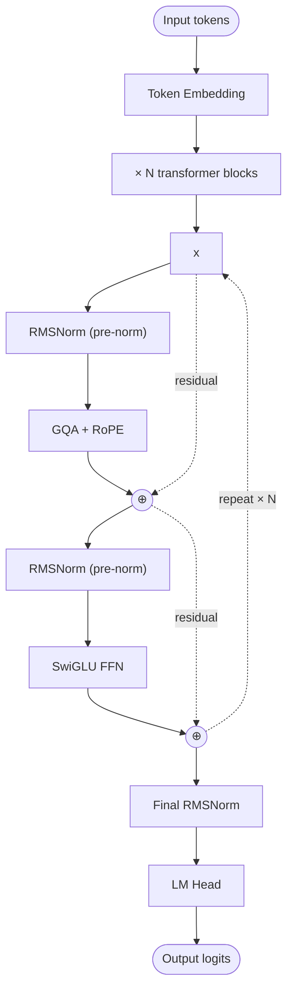

# Granite 4.1 — Architecture

## Identity

Granite 4.1 (**IBM, 2026**) is IBM's open-weight enterprise LLM family. Continues IBM's "enterprise-safe AI" positioning with permissive licensing, careful data sourcing, and a conservative modern recipe. Available in dense and possibly sparse variants.

| Spec | Granite 4.1 |
|---|---|
| Released | 2026 |
| Organization | [[IBM]] |
| Total params | 30B+ |
| Architecture | Dense (and/or MoE for larger variants) |
| Attention | [[Grouped-Query Attention\|GQA]] |
| Norm | [[RMSNorm]] |
| Position | RoPE |
| FFN | SwiGLU (dense) or sparse MoE |
| License | Apache 2.0 |

## Block diagram (dense variant)

## IBM's distinctive positioning

Granite is the **enterprise-trust** open LLM:
- **Apache 2.0 license** — fully permissive.
- **Data provenance** — IBM publishes detailed data sourcing for trust/audit.
- **Conservative architecture** — IBM tracks the field but doesn't lead architectural changes.
- **IP indemnification** — IBM offers customers legal protection for Granite-generated outputs.

This makes Granite the default open LLM choice for regulated industries (finance, healthcare, government).

## Granite family lineage

| Model | Year | Focus |
|---|---|---|
| Granite 13B | 2023 | First IBM open release |
| Granite Code (various) | 2024 | Code-specialized |
| Granite 3.0 | 2024 | Refined dense recipe |
| Granite 3.1 / 3.2 / 3.3 | 2024–2025 | Incremental |
| **Granite 4.1** | 2026 | Current flagship |

## Connections

- [[IBM]]
- [[GQA]], [[RMSNorm]], [[SwiGLU]], [[RoPE]]
- [[Llama 3]] — architectural cousin
- [[LLM Architecture]] — hub
- [[LLM Architecture Landscape 2026]] — comparative synthesis
- [[2026-05-28-raschka-llm-architecture-gallery]] — source

## Open Questions

- Will Granite ever adopt MoE / MLA at frontier scale, or stay conservatively dense?
- Detailed configuration of Granite 4.1 — Raschka's gallery entry was partially truncated.
