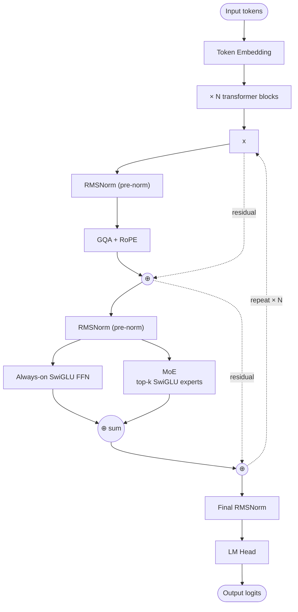

# Grok 2.5 — Architecture

## Identity

Grok 2.5 (**xAI, August 22, 2025**) is xAI's open-weight 270B MoE model. Released after xAI's flagship API releases, providing the first public view of the Grok architecture. Notable for an **"always-on SwiGLU"** pattern alongside its MoE FFN.

| Spec | Grok 2.5 |
|---|---|
| Released | 2025-08-22 |
| Total params | 270B |
| Architecture | Sparse [[Mixture of Experts\|MoE]] |
| Attention | [[Grouped-Query Attention\|GQA]] |
| FFN | MoE + **always-on SwiGLU branch** |
| Norm | RMSNorm |
| Position | RoPE |
| License | Grok 2 license |
| Organization | xAI |

## Always-on SwiGLU pattern

Most MoE models have a clean separation: FFN block = router → top-k experts. Grok 2.5 adds an **always-on SwiGLU FFN** that runs in parallel to the MoE branch. Both contribute additively to the residual:

```
                  x
                  │
            ┌─────┴─────┐
            │           │
            ▼           ▼
       ┌────────┐  ┌──────────────┐
       │Always- │  │ MoE Router   │
       │on      │  │   ↓          │
       │SwiGLU  │  │ top-k experts│
       │FFN     │  │ (SwiGLU each)│
       └────┬───┘  └──────┬───────┘
            │             │
            └──────⊕──────┘
                   │
                   ▼
              + residual
```

This is functionally similar to [[DeepSeek-V3]]'s **shared expert** (always-on universal computation), but architecturally placed as a parallel FFN branch rather than as one of the experts.

## Block diagram



## Recipe summary

- **Sparse MoE** + always-on SwiGLU (functionally like a shared expert).
- **GQA** (no MLA).
- **RMSNorm** pre-norm.
- **No QK-Norm.**
- **RoPE** position encoding.

## Connections

- [[Mixture of Experts]]
- [[SwiGLU]]
- [[GQA]], [[RMSNorm]], [[RoPE]]
- [[DeepSeek-V3]] — shared-expert pattern (functionally similar)
- [[LLM Architecture]] — hub
- [[LLM Architecture Landscape 2026]] — comparative synthesis
- [[2026-05-28-raschka-llm-architecture-gallery]] — source

## Open Questions

- Is the always-on SwiGLU empirically better than a shared expert at the same parameter budget?
- xAI's frontier Grok 4/5 architecture — public details limited.
