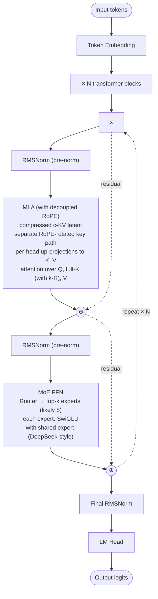

# Kimi K2 — Architecture

## Identity

Kimi K2 (**Moonshot AI, July 10, 2025**) is a **1-trillion-parameter [[Mixture of Experts|MoE]] model** with [[Multi-head Latent Attention|MLA]], from Beijing-based Moonshot. Notable for being the **first open-weight 1T-scale MoE** and for **adopting DeepSeek's MLA + fine-grained MoE recipe** at larger total scale. Updated to **Kimi K2.5** (Jan 2026, 256K context) and **Kimi K2.6** (1M context).

| Spec | Kimi K2 | Kimi K2.5 | Kimi K2.6 |
|---|---|---|---|
| Released | 2025-07-10 | 2026-01-27 | 2026 |
| Total params | 1T | 1T | 1T |
| Active params | ~32B (3.2% active) |
| Attention | [[Multi-head Latent Attention\|MLA]] |
| FFN | Sparse [[Mixture of Experts\|MoE]] |
| Context | 128K | 256K | 1M |
| License | MIT (or near-permissive) |
| Organization | Moonshot AI |

## Block diagram (Kimi K2)

## Architectural distinctives

- **First open-weight 1T-scale MoE** — beats DeepSeek-V3 total parameter count.
- **3.2% active ratio** — even sparser than DeepSeek-V3's 5.5%, more aggressive sparsity bet.
- **MLA at this scale** — validates DeepSeek's KV-cache-compression innovation outside DeepSeek.
- **Long context** — K2.5 at 256K, K2.6 at 1M (without sliding window).

## Kimi Linear (sibling hybrid)

Moonshot also released **Kimi Linear (48B-A3B)** in Oct 2025 — a hybrid combining **[[Linear Attention]] + MLA** with 1M context. Same lab, different architectural bet (linear attention rather than full MLA at all layers).

## Recipe diff vs DeepSeek-V3

| Component | DeepSeek-V3 | Kimi K2 |
|---|---|---|
| Total / Active | 671B / 37B | 1T / ~32B |
| Active % | 5.5% | 3.2% |
| Attention | MLA | MLA |
| MoE recipe | 256 + 1 shared, top-8 | similar (details less public) |
| Aux-loss-free balancing | Yes | likely |
| MTP | Yes | not disclosed |
| Context | 128K (V3) | 1M (K2.6) |

## Connections

- [[Multi-head Latent Attention]]
- [[Mixture of Experts]]
- [[DeepSeek-V3]] — recipe ancestor
- [[Linear Attention]] — sibling Kimi Linear bet
- [[Mamba]] — adjacent linear-time family
- [[LLM Architecture]] — hub
- [[LLM Architecture Landscape 2026]] — comparative synthesis
- [[2026-05-28-raschka-llm-architecture-gallery]] — source

## Open Questions

- Public MoE configuration details (expert count, top-k, shared expert) — partially disclosed.
- How Kimi K2.6 reaches 1M context architecturally — pure MLA + RoPE scaling, or additional techniques?
