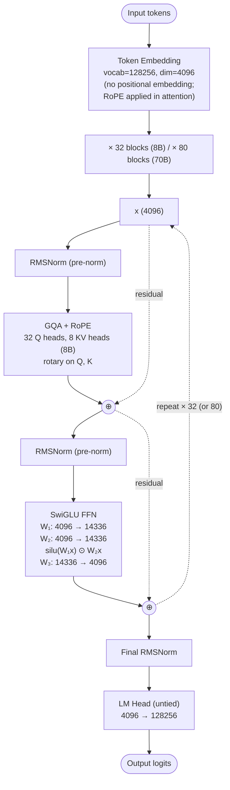

# Llama 3 — Architecture

## Identity

The **canonical 2024 modern dense LLM** from [[Meta AI]]. Released **April 18, 2024** in 8B, 70B sizes; later expanded to 405B (July 2024), 3.2 (1B/3B), 3.3 (70B). Llama 3 is the reference against which every other 2024–2026 dense LLM is compared — its recipe (RMSNorm + SwiGLU + RoPE + GQA + pre-norm) is the "modern dense default" the open-weight ecosystem copies.

| Spec | Llama 3 8B | Llama 3 70B |
|---|---|---|
| Released | 2024-04-18 | 2024-04-18 |
| Organization | [[Meta AI]] |
| Parameters | 8B | 70B |
| Layers | 32 | 80 |
| Hidden dim | 4096 | 8192 |
| Q heads | 32 | 64 |
| KV heads | 8 ([[Grouped-Query Attention\|GQA]] 4:1) | 8 (GQA 8:1) |
| FFN dim | 14336 (SwiGLU adjusted) | 28672 |
| Context length | 8K (3.0); 128K (3.1+) |
| Vocab | 128256 (tiktoken-style BPE) |
| License | Llama 3 Community License |

## Block diagram

## Recipe diff vs GPT-2

What changed:

| Component | GPT-2 | Llama 3 |
|---|---|---|
| Norm | LayerNorm | [[RMSNorm]] |
| Attention | [[Multi-Head Attention\|MHA]] | [[Grouped-Query Attention\|GQA]] |
| Position | Learned absolute | [[Rotary Position Embeddings\|RoPE]] |
| FFN | GELU | [[SwiGLU]] |
| Vocab | 50257 BPE | 128256 BPE (tiktoken-derived) |
| Context | 1024 | 8K → 128K (3.1+) |
| Embed/LM-head | Tied | Untied |

What didn't change: block structure (norm → attn → +residual → norm → ffn → +residual), pre-norm placement, decoder-only autoregressive, BPE tokenizer family.

## Llama 3.2 variants

| Variant | Year | Params | Special |
|---|---|---|---|
| Llama 3 8B | 2024-04 | 8B | dense |
| Llama 3 70B | 2024-04 | 70B | dense |
| Llama 3.1 405B | 2024-07 | 405B | dense |
| Llama 3.2 1B | 2024-09 | 1B | edge-targeted |
| Llama 3.2 3B | 2024-09 | 3B | edge-targeted |
| Llama 3.2 11B Vision | 2024-09 | 11B | + vision adapter |
| Llama 3.2 90B Vision | 2024-09 | 90B | + vision adapter |
| Llama 3.3 70B | 2024-12 | 70B | enhanced training |

## Why Llama 3 is the modern reference

- **Open weights with permissive-enough license** — most labs can use it as a baseline.
- **Recipe is industry-default** — RMSNorm + SwiGLU + RoPE + GQA appears in Mistral, Qwen, Gemma, OLMo, Phi.
- **Clean implementation** — Meta's reference code is widely studied.
- **Strong empirical baseline** — 405B was at GPT-4 class on many tasks at release.
- **Sets size class conventions** — 1B / 3B / 8B / 70B / 405B is the de-facto open-weight ladder.

## Connections

### Components
- [[RMSNorm]], [[SwiGLU]], [[Rotary Position Embeddings]], [[Grouped-Query Attention]]
- [[Multi-Head Attention]] (what GQA generalizes)

### Lineage
- [[GPT-2]] — the historical anchor Llama 3 modernizes
- [[Llama 4]] — successor (MoE, native multimodal)
- [[Llama Guard]] — companion safety model
- [[LLM Architecture]] — hub
- [[LLM Architecture Landscape 2026]] — comparative synthesis

### Adjacent dense models
- [[Mistral Small 3]], [[Qwen3]] (dense variants), [[Phi-4]], [[OLMo 2]], [[Gemma 3]]

### Organization
- [[Meta AI]]

### Source
- [[2026-05-28-raschka-llm-architecture-gallery]]

## Open Questions

- What's the smallest model where the modern recipe (RMSNorm/SwiGLU/RoPE/GQA) clearly beats GPT-2-era choices?
- Llama 4 went MoE; is there a future Llama 5 dense flagship?
- Does Llama 3.3's training-only refinements indicate the recipe has plateaued?
