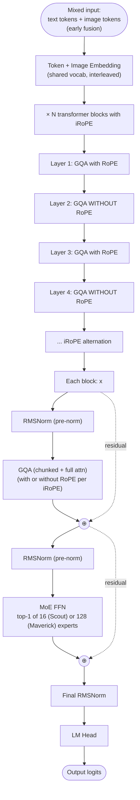

# Llama 4 — Architecture

## Identity

Llama 4 ([[Meta AI]], **April 5, 2025**) is Meta's first **[[Mixture of Experts|MoE]] and natively-multimodal** Llama generation. Released as **Llama 4 Scout** (16 experts, 10M context) and **Llama 4 Maverick** (128 experts, beats GPT-4o on multimodal benchmarks), with a frontier-scale **Llama 4 Behemoth** as a research-preview teacher.

This page covers the **architecture in depth** with block diagrams; for the entity / org / variants / impact narrative, see [[Llama 4]] (entity page).

| Spec | Llama 4 Scout | Llama 4 Maverick | Llama 4 Behemoth |
|---|---|---|---|
| Released | 2025-04-05 |
| Total params | ~110B | ~400B | ~2T |
| Active params | ~17B | ~17B | ~288B (research) |
| Experts | 16 (top-1) | 128 (top-1) | larger |
| Attention | GQA + iRoPE | GQA + iRoPE | GQA + iRoPE |
| Context | 10M | 1M | research |
| Multimodal | Native (image tokens) | Native | Native |
| Norm | RMSNorm |
| FFN | MoE (SwiGLU experts) |
| License | Llama 4 Community License |

## Block diagram

## Llama 4's distinctive innovations

### 1. iRoPE (interleaved RoPE)

Alternates layers with and without rotary positional encoding. Layers *with* RoPE provide explicit position information; layers *without* (effectively [[NoPE]]) help length generalization to very long contexts (10M in Scout).

### 2. Top-1 routing

Maverick routes each token to exactly **1** expert from 128, with a residual / shared computation pathway. Counterintuitive vs DeepSeek-V3's top-8 of 256 — Meta is betting on a different sparsity geometry.

### 3. Chunked attention + full attention

Llama 4 uses **chunked attention** for most layers (similar to [[Sliding Window Attention]] but block-structured) interleaved with full attention. This enables the 10M Scout context.

### 4. Native multimodal (early fusion)

Image patches are tokenized and concatenated with text tokens, processed by the same transformer trunk. No separate vision encoder + projection — Llama 4 is one of the first major **early-fusion** native multimodal open-weights models.

## Recipe diff vs Llama 3

| Component | Llama 3 8B | Llama 4 Maverick |
|---|---|---|
| Dense vs MoE | Dense | **MoE (top-1 of 128)** |
| Multimodal | Adapter (3.2 Vision) | **Native early-fusion** |
| Position | RoPE | **iRoPE (alternating)** |
| Attention | GQA (full) | GQA (chunked + full alternation) |
| Context | 128K | **1M (Maverick), 10M (Scout)** |
| Active params | 8B | 17B |
| Norm | RMSNorm | RMSNorm |
| FFN | SwiGLU | MoE experts (SwiGLU each) |
| QK-Norm | No | No |
| License | Llama 3 Community | Llama 4 Community |

## Recipe diff vs DeepSeek-V3

| Component | DeepSeek-V3 | Llama 4 Maverick |
|---|---|---|
| Total / Active | 671B / 37B | ~400B / ~17B |
| Attention | MLA | GQA + iRoPE |
| FFN | 256 + 1 shared, top-8 | 128, top-1 |
| Shared expert | Yes | Residual/shared via different mechanism |
| Multimodal | No (text-only V3; VL2 separate) | **Yes, native** |
| Context | 128K | 1M / 10M |
| MTP | Yes | No |

Different bets: DeepSeek goes deep on MLA + fine-grained experts; Meta goes wide on context + multimodal + simpler top-1 routing.

## Connections

- [[Llama 4]] (entity page) — identity / org / impact narrative
- [[Llama 3]] — predecessor (dense)
- [[Mixture of Experts]] — sparsity strategy
- [[Vision Language Models]] — native multimodal context
- [[NoPE]] — iRoPE's no-rope half
- [[Rotary Position Embeddings]] — iRoPE's rope half
- [[Sliding Window Attention]] — adjacent chunked-attention idea
- [[RMSNorm]], [[SwiGLU]], [[GQA]]
- [[Meta AI]]
- [[DeepSeek-V3]] — contrasting MoE design
- [[LLM Architecture]] — hub
- [[LLM Architecture Landscape 2026]] — comparative synthesis
- [[2026-05-28-raschka-llm-architecture-gallery]] — source
- [[2026-05-28-vision-language-models-2026]] — multimodal source

## Open Questions

- Top-1 vs top-8 routing — Meta vs DeepSeek philosophical split.
- iRoPE optimal alternation ratio.
- Will Llama 5 commit to multimodal-native exclusively, or split dense vs MoE lineages?
