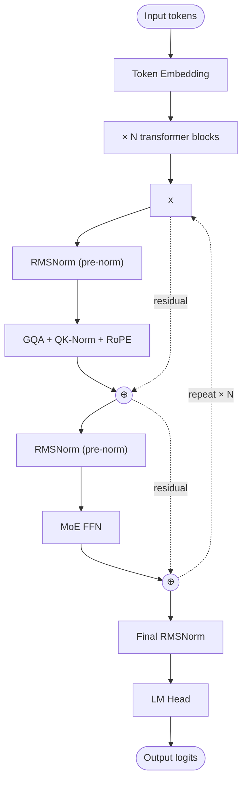

# MiniMax-M2 — Architecture

## Identity

MiniMax-M2 (**MiniMax, October 23, 2025**) is a 230B sparse [[Mixture of Experts|MoE]] model with [[Grouped-Query Attention|GQA]] + [[QK-Norm]], positioned as an **agent-focused** model — tuned for tool use, multi-step planning, and long-context agentic workflows. Refined as **MiniMax-M2.5** (Feb 2026) and **MiniMax-M2.7** (Mar 2026).

| Spec | MiniMax-M2 | MiniMax-M2.5 | MiniMax-M2.7 |
|---|---|---|---|
| Released | 2025-10-23 | 2026-02-12 | 2026-03-18 |
| Total params | 230B | 230B | 230B |
| Active params | ~10B (4.3% active) |
| Attention | GQA + QK-Norm |
| FFN | Sparse MoE |
| Norm | RMSNorm + QK-Norm |
| Position | RoPE |
| Focus | Agent / tool use |
| Organization | MiniMax |

## Block diagram

## Recipe summary

| Component | Choice |
|---|---|
| Attention | GQA + QK-Norm |
| FFN | Sparse MoE |
| Norm | RMSNorm + QK-Norm |
| Position | RoPE |
| Active % | 4.3% (very sparse) |

Architecturally close to [[Qwen3]] 235B-A22B: GQA + QK-Norm + MoE without MLA.

## What "agent-focused" means

MiniMax-M2's agent focus is primarily a **training-data and post-training** distinction, not an architectural one — extensive tool-use training, multi-step planning data, long-context agent traces. The architecture itself is standard 2025 GQA + MoE.

## Connections

- [[Mixture of Experts]]
- [[GQA]], [[QK-Norm]], [[RMSNorm]], [[RoPE]], [[SwiGLU]]
- [[Qwen3]] — architecturally similar
- [[LLM Architecture]] — hub
- [[LLM Architecture Landscape 2026]] — comparative synthesis
- [[2026-05-28-raschka-llm-architecture-gallery]] — source

## Open Questions

- Does agent-focused fine-tuning eventually demand architectural changes (longer memory, structured tool tokens)?
