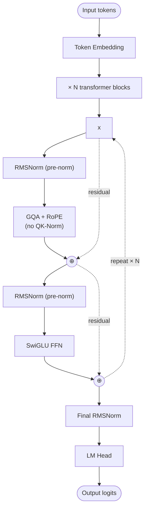

# Mistral Small 3 — Architecture

## Identity

Mistral Small 3.1 (**Mistral AI, March 18, 2025**) is Mistral's flagship modern dense open-weight LLM — 24B parameters, 128K context, Apache-2 licensed. Architecturally a **clean modern dense recipe**: [[Grouped-Query Attention|GQA]] + [[RMSNorm]] + [[SwiGLU]] + [[Rotary Position Embeddings|RoPE]] + pre-norm, with no [[QK-Norm]] (notable hold-out from the 2025 norm).

| Spec | Mistral Small 3.1 24B |
|---|---|
| Released | 2025-03-18 |
| Organization | [[Mistral AI]] |
| Parameters | 24B |
| Attention | [[Grouped-Query Attention\|GQA]] |
| Norm | [[RMSNorm]] (no QK-Norm) |
| Norm placement | Pre-norm |
| FFN | [[SwiGLU]] |
| Position | [[Rotary Position Embeddings\|RoPE]] |
| Context | 128K |
| License | Apache 2.0 |

## Block diagram

## Recipe diff vs Llama 3

| Component | Llama 3 8B | Mistral Small 3.1 24B |
|---|---|---|
| Norm | RMSNorm | RMSNorm |
| QK-Norm | No | **No** |
| Attention | GQA | GQA |
| FFN | SwiGLU | SwiGLU |
| Position | RoPE | RoPE |
| Context | 128K (3.1) | 128K |
| License | Llama 3 Community | **Apache 2.0** |

Mistral Small 3 is **almost architecturally identical to Llama 3.1** at this scale — the differentiator is data, training, and licensing. This makes it the cleanest demonstration that the "modern dense recipe" is widely shared.

## Mistral Small history vs the Large series

Mistral's larger flagship models took a different architectural path:
- **Mistral Large 3** (Dec 2025, 673B) — adopted [[Multi-head Latent Attention|MLA]] and sparse [[Mixture of Experts|MoE]] (6.1% active).
- **Mistral Small 4** (Mar 2026, 119B) — adopted MLA + MoE (5.6% active).

So Mistral's lineage: dense modern-recipe at small scale, MLA + MoE at large scale.

## Connections

- [[Mistral AI]] — parent org
- [[Mixtral]] — Mistral's first MoE
- [[Llama 3]] — architectural twin at this scale
- [[Multi-head Latent Attention]] — adopted in Mistral Large 3 / Small 4
- [[GQA]], [[RMSNorm]], [[SwiGLU]], [[RoPE]]
- [[LLM Architecture]] — hub
- [[LLM Architecture Landscape 2026]] — comparative synthesis
- [[2026-05-28-raschka-llm-architecture-gallery]] — source

## Open Questions

- Why doesn't Mistral adopt QK-Norm? (Most other 2025–2026 labs did.)
- Will Mistral Small 4 stay dense at small scale, or transition to MoE?
