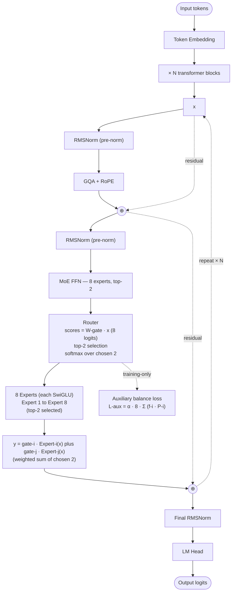

# Mixtral — Architecture

## Identity

Mixtral ([[Mistral AI]], December 2023 / April 2024) is the **first widely-used open-weight MoE model family**. Two sizes: **Mixtral 8x7B** (47B total, 12.9B active) and **Mixtral 8x22B** (141B total, 39B active). Both use **8 experts per layer with top-2 routing**, an auxiliary balance loss, and otherwise the standard modern dense recipe (RMSNorm + SwiGLU + RoPE + GQA + pre-norm).

This page covers the **architecture in depth** with block diagrams; for the entity / org / impact narrative, see [[Mixtral]] (entity page).

| Spec | Mixtral 8x7B | Mixtral 8x22B |
|---|---|---|
| Released | 2023-12 | 2024-04 |
| Total params | 47B | 141B |
| Active params | 12.9B | 39B |
| Experts | 8 routed (no shared) | 8 routed |
| Routing | top-2 of 8 | top-2 of 8 |
| Attention | [[Grouped-Query Attention\|GQA]] | GQA |
| Norm | RMSNorm pre-norm |
| Position | RoPE |
| FFN | SwiGLU experts |
| Window | Sliding window (Mistral 7B legacy) + global | Global |
| Load balancing | **Auxiliary balance loss** (classic) |
| License | Apache 2.0 |

## Block diagram

## The Mixtral recipe in detail

### "8x7B" naming

Mixtral 8x7B's name is slightly misleading. It's not 8 × 7B = 56B parameters — only the **FFN is replicated 8×**; attention layers are shared. So total = ~47B, not 56B.

### Top-2 of 8 routing

Each token activates 2 of 8 experts. Per-token active FFN compute = 2 × (single FFN compute), about 25% of a fully-dense 8x7B (which would activate all 8). This is the canonical "MoE sweet spot" pre-2024.

### Auxiliary balance loss

Mixtral adds the classic balance penalty:

$$\mathcal{L}_{\text{aux}} = \alpha \cdot N \cdot \sum_{i=1}^{N} f_i \cdot P_i$$

Where $f_i$ is the fraction of tokens routed to expert $i$ and $P_i$ is the average gating weight. Penalizes uneven utilization. Mixtral uses $\alpha = 0.01$ approximately.

### No shared expert

Unlike DeepSeek-V3's recipe, Mixtral has **no shared expert** — all 8 are routed. The Mistral team's bet: with only 8 experts, every token gets enough "universal" coverage from the top-2 random subset.

## Recipe diff vs DeepSeek-V3

| Component | Mixtral 8x7B | DeepSeek-V3 |
|---|---|---|
| Total params | 47B | 671B |
| Active params | 12.9B (27%) | 37B (5.5%) |
| Experts | 8 (top-2) | 256 + 1 shared (top-8) |
| Attention | GQA | **MLA** |
| Load balancing | Auxiliary loss | **Aux-loss-free bias** |
| Shared expert | No | **Yes** |
| MTP | No | Yes |
| Training precision | bf16 | **FP8** |

DeepSeek-V3 is the next-generation refinement of Mixtral's recipe — finer-grained experts, shared expert, better balancing, smaller KV cache (MLA), better gradient signal (MTP), and FP8.

## Recipe diff vs Llama 3 8B (the dense alternative)

| Component | Llama 3 8B | Mixtral 8x7B |
|---|---|---|
| Total params | 8B | 47B |
| Active params | 8B | 12.9B |
| FFN | Dense SwiGLU | **8 SwiGLU experts, top-2** |
| Attention | GQA | GQA |
| Norm | RMSNorm | RMSNorm |
| Position | RoPE | RoPE |
| Quality on benchmarks | ~70% MMLU | ~70% MMLU |
| License | Llama 3 Community | **Apache 2.0** |

Mixtral 8x7B and Llama 3 8B reached similar MMLU at different total-vs-active parameter trade-offs — proving the MoE recipe could match dense at compute parity, with much larger total capacity.

## Connections

- [[Mixtral]] (entity page) — identity / org / impact narrative
- [[Mixture of Experts]] — broader concept
- [[Mistral AI]] — parent org
- [[Mistral Small 3]] — sibling modern dense
- [[DeepSeek-V3]] — next-gen successor MoE design
- [[GQA]], [[RMSNorm]], [[SwiGLU]], [[RoPE]]
- [[Llama 3]] — dense reference at similar quality
- [[LLM Architecture]] — hub
- [[LLM Architecture Landscape 2026]] — comparative synthesis
- [[2026-05-28-raschka-llm-architecture-gallery]] — source
- [[2026-05-28-mixture-of-experts-2026]] — MoE source

## Open Questions

- Why Mistral hasn't released a "Mixtral 3" / "Mixtral 2" sequel — the lab pivoted to Mistral Large 3 / Small 4 with MLA + fine-grained MoE.
- Mixtral's "8 large experts, top-2" recipe has been displaced by "many small experts, top-8" — was this always inevitable, or hardware-driven?
