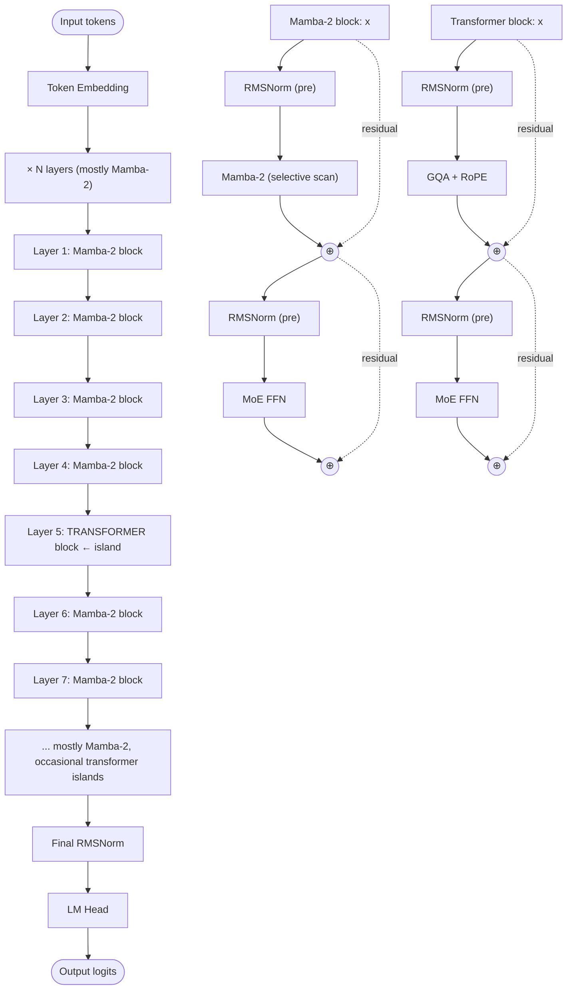

# Nemotron 3 — Architecture

## Identity

Nemotron 3 (**NVIDIA, December 4, 2025**) is NVIDIA's open-weight hybrid LLM family — **mostly [[Mamba|Mamba-2]] state-space layers with transformer islands** and **sparse [[Mixture of Experts|MoE]] FFNs**. Released in **Nemotron 3 Nano (30B-A3B)**, **Nemotron 3 Super (120B-A12B)** with MTP, and a smaller **Nemotron 3 Nano 4B** (hybrid Mamba-2 + GQA, no MoE).

| Spec | Nemotron 3 Nano | Nemotron 3 Super | Nemotron 3 Nano 4B |
|---|---|---|---|
| Released | 2025-12-04 | 2026-03-11 | 2026-03-16 |
| Organization | [[NVIDIA]] |
| Total params | 30B | 120B | 4B |
| Active params | 3B (MoE) | 12B (MoE; latent experts) | 4B (dense) |
| Sequence mixer | **Mostly Mamba-2 + transformer islands** | Mostly Mamba-2 + transformer + latent experts | Mostly Mamba-2 + GQA |
| FFN | Sparse MoE | Sparse MoE | Dense SwiGLU |
| MTP | No | **Yes** | No |
| License | NVIDIA Open Model License |

## Block diagram (Nemotron 3 hybrid pattern)

The ratio of Mamba-2 to transformer layers is typically **5–10:1** — heavily Mamba-dominant.

## Why hybrid?

Pure Mamba models underperform transformers on **in-context learning** and **hard retrieval**. The hybrid recipe — a few well-placed transformer attention layers among many Mamba layers — captures most of the linear-time efficiency benefit while restoring transformer-quality in-context learning.

Mamba-2 layers handle:
- Long-range sequence modeling
- Streaming / online inference
- Constant memory per step

Transformer attention layers handle:
- In-context learning (few-shot examples in prompt)
- Hard retrieval (find a specific token in long context)
- Reasoning chains

## Latent experts (Nemotron 3 Super)

Nemotron 3 Super introduces **latent experts** — the MoE FFN's experts share weights via a low-rank latent projection, dramatically reducing total parameter count while preserving the expert-routing structure. Combined with MTP (auxiliary multi-token prediction loss), this is NVIDIA's most aggressive efficiency bet.

## Connections

- [[Mamba]] — main sequence mixer
- [[State Space Models]] — broader family
- [[Mixture of Experts]]
- [[Multi-Token Prediction]] — used in Super
- [[Linear Attention]] — adjacent family
- [[GQA]], [[RMSNorm]], [[SwiGLU]], [[RoPE]]
- [[NVIDIA]]
- [[LLM Architecture]] — hub
- [[LLM Architecture Landscape 2026]] — comparative synthesis
- [[2026-05-28-raschka-llm-architecture-gallery]] — source

## Open Questions

- Optimal Mamba-2 : transformer layer ratio at frontier scale.
- Where to place transformer islands — front, middle, end, alternating?
- Latent experts vs standard MoE — quality-vs-efficiency tradeoff.
