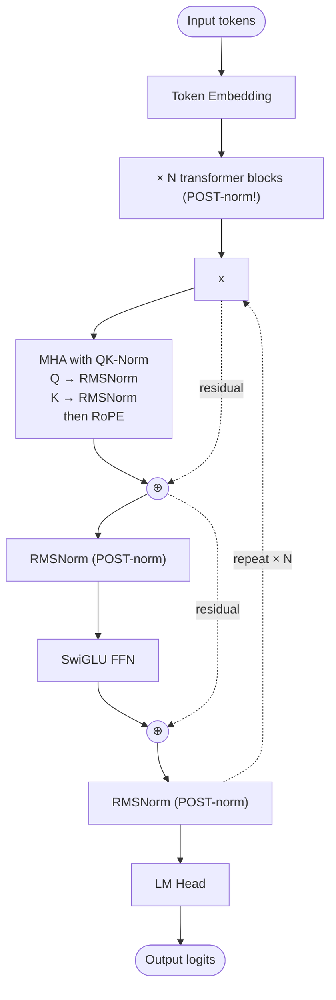

# OLMo 2 — Architecture

## Identity

OLMo 2 (Open Language Model 2) is **Allen AI's fully-open LLM family** — open weights, **open data, open training code, open intermediate checkpoints**. Released **November 25, 2024** in 7B and 13B sizes. OLMo's distinction is *radical openness*; architecturally, its contribution is **popularizing [[QK-Norm]]** in open LLMs and revisiting **post-norm** for training stability.

| Spec | OLMo 2 7B | OLMo 2 13B |
|---|---|---|
| Released | 2024-11-25 |
| Organization | Allen Institute for AI (AI2) |
| Parameters | 7B | 13B |
| Layers | 32 | 40 |
| Heads | 32 ([[Multi-Head Attention\|MHA]], not GQA) |
| FFN | SwiGLU |
| Norm | [[RMSNorm]] + [[QK-Norm]] |
| Norm placement | **Post-norm** (revival) |
| Position | [[Rotary Position Embeddings\|RoPE]] |
| Context | 4K initial, extended later |
| License | Apache 2.0 (weights + data + code) |

## Block diagram

## Recipe diff vs Llama 3

| Component | Llama 3 8B | OLMo 2 7B |
|---|---|---|
| Attention | GQA (32 Q, 8 KV) | **MHA (32 Q, 32 KV)** |
| Norm type | RMSNorm | RMSNorm + **QK-Norm** |
| Norm placement | Pre-norm | **Post-norm** |
| FFN | SwiGLU | SwiGLU |
| Position | RoPE | RoPE |
| Open data | No | **Yes — Dolma corpus** |

OLMo 2 makes two notable bets:
1. **MHA over GQA** at 7B scale — argues that GQA's serving advantage isn't worth quality cost at this scale.
2. **Post-norm + QK-Norm** — claimed better training stability and final quality despite pre-norm being the modern default.

## Why OLMo matters

- **Reproducible science** — full open data + code means architecture/data ablations are auditable.
- **Established QK-Norm in open LLMs** — Gemma 3/4, Qwen3, GLM-4.5/5 all adopted post-OLMo-2.
- **Post-norm revival** — most labs stayed pre-norm; OLMo's success here is a counterexample.
- **Pedagogical anchor** — OLMo 2 is the most-detailed *fully-documented* training run in the open ecosystem.

## Connections

- [[QK-Norm]] — popularized by OLMo 2
- [[RMSNorm]], [[SwiGLU]], [[Rotary Position Embeddings]]
- [[Multi-Head Attention]] — OLMo's attention choice (not GQA)
- [[OLMo 3]] — successor with GQA + sliding window
- [[Llama 3]] — pre-norm/GQA contrast
- [[LLM Architecture]] — hub
- [[LLM Architecture Landscape 2026]] — comparative synthesis
- [[2026-05-28-raschka-llm-architecture-gallery]] — source

## Open Questions

- At what scale does post-norm + QK-Norm beat pre-norm + no-QK-Norm?
- Why did the rest of the field stay pre-norm despite OLMo 2's results?
