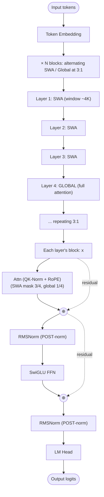

# OLMo 3 — Architecture

## Identity

OLMo 3 (Allen Institute for AI, **November 20, 2025**) is the successor to [[OLMo 2]]. Two sizes — 7B (MHA) and 32B (GQA) — both incorporating **sliding-window attention** alternated 3:1 with global attention, retaining OLMo 2's [[QK-Norm]] and **post-norm** choices.

| Spec | OLMo 3 7B | OLMo 3 32B |
|---|---|---|
| Released | 2025-11-20 |
| Organization | Allen Institute for AI (AI2) |
| Parameters | 7B | 32B |
| Attention | [[Multi-Head Attention\|MHA]] | [[Grouped-Query Attention\|GQA]] |
| Norm | RMSNorm + [[QK-Norm]] |
| Norm placement | **Post-norm** |
| Attention pattern | **3 SWA : 1 Global** |
| Position | RoPE |
| FFN | SwiGLU |
| License | Apache 2.0 (full open data + code) |

## Block diagram

## Recipe diff vs OLMo 2

| Component | OLMo 2 (7B) | OLMo 3 (7B / 32B) |
|---|---|---|
| Attention pattern | All global | **3 SWA : 1 Global** (mixed) |
| 32B uses GQA | n/a | Yes (32B variant) |
| Norm | RMSNorm + QK-Norm post-norm | Same |
| FFN | SwiGLU | SwiGLU |
| Position | RoPE | RoPE |

OLMo 3's main architectural update: adopt **[[Sliding Window Attention]]** as the local-attention block, alternated with global layers. This trims KV cache and follows the broader 2025 trend (Gemma 3/4, GPT-OSS, Tiny Aya).

## Connections

- [[OLMo 2]] — predecessor
- [[Sliding Window Attention]] — newly adopted in OLMo 3
- [[QK-Norm]], [[RMSNorm]], [[SwiGLU]], [[Rotary Position Embeddings]]
- [[Grouped-Query Attention]] (32B variant)
- [[LLM Architecture]] — hub
- [[LLM Architecture Landscape 2026]] — comparative synthesis
- [[2026-05-28-raschka-llm-architecture-gallery]] — source

## Open Questions

- Why 3:1 instead of 5:1 (Gemma 3) — what's optimal?
- Does the 32B's GQA + SWA combination match dense Llama 70B?
