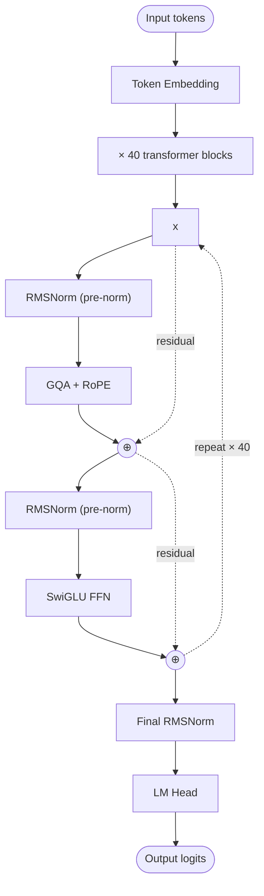

# Phi-4 — Architecture

## Identity

Phi-4 (**Microsoft, December 12, 2024**) is the flagship of Microsoft's "small models, curated data" research line. 14B dense, beating much larger models on math and reasoning benchmarks. Architecturally **conservatively modern**: GQA + RoPE + RMSNorm + SwiGLU + pre-norm, no QK-Norm, no exotic attention. Phi-4's distinguishing bet is **synthetic / curated training data**, not architecture.

| Spec | Phi-4 14B |
|---|---|
| Released | 2024-12-12 |
| Organization | [[Microsoft]] |
| Parameters | 14B |
| Layers | 40 |
| Attention | [[Grouped-Query Attention\|GQA]] |
| Norm | [[RMSNorm]] (no QK-Norm) |
| Position | [[Rotary Position Embeddings\|RoPE]] |
| FFN | [[SwiGLU]] |
| Context | 16K |
| License | MIT |

## Block diagram

Architecturally, Phi-4 is **almost identical to Llama 3 at this scale**. The differentiator is the training corpus — heavily synthetic, math/code-curated, with a focus on quality over quantity.

## Why Phi-4 matters architecturally

It's a **counterexample**: Phi-4 demonstrates that at sub-20B scale, **architectural choices matter less than data curation**. Phi-4 14B outperforms many 30–70B dense models on math (MATH benchmark) and reasoning (GPQA), using the same recipe.

This makes Phi-4 the canonical example of "data > architecture at small scale."

## Phi family lineage

| Model | Year | Params | Notes |
|---|---|---|---|
| Phi-1 | 2023 | 1.3B | "Textbooks Are All You Need" — first synthetic-data bet |
| Phi-1.5 | 2023 | 1.3B | Refined |
| Phi-2 | 2023 | 2.7B | Stronger general capabilities |
| Phi-3 mini / small / medium | 2024 | 3.8B / 7B / 14B | Modern recipe |
| **Phi-4** | 2024 | 14B | Flagship; mathematics focus |

## Connections

- [[Microsoft]] — parent org
- [[Llama 3]] — architectural twin at similar scale
- [[GQA]], [[RMSNorm]], [[SwiGLU]], [[RoPE]]
- [[LLM Architecture]] — hub
- [[LLM Architecture Landscape 2026]] — comparative synthesis
- [[2026-05-28-raschka-llm-architecture-gallery]] — source

## Open Questions

- Does data curation continue to compound at 70B+ scale, or only matter for small models?
- What's the architectural ceiling — is there a Phi-5 that swaps to MoE or MLA?
