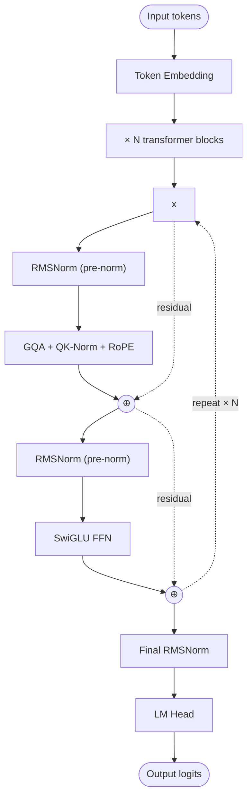
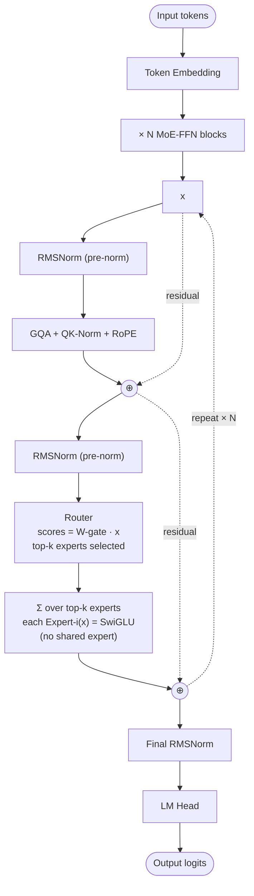

# Qwen3 — Architecture

## Identity

Qwen3 ([[Alibaba]] Qwen team, **April 28, 2025**) is the broadest open-weight LLM family of 2025 — sizes from **0.6B to 235B** spanning both **dense** and **sparse MoE**. The recipe: [[Grouped-Query Attention|GQA]] + [[QK-Norm]] + [[RMSNorm]] pre-norm + [[SwiGLU]] + [[Rotary Position Embeddings|RoPE]] for all variants, with MoE swapping in for the FFN at large scales.

| Variant | Released | Total / Active | Architecture |
|---|---|---|---|
| Qwen3 0.6B | 2025-04-28 | 0.6B | Dense, 28 layers |
| Qwen3 4B | 2025-04-28 | 4B | Dense |
| Qwen3 8B | 2025-04-28 | 8B | Dense |
| Qwen3 14B | 2025-04-28 | 14B | Dense |
| Qwen3 32B | 2025-04-28 | 32B | Dense |
| Qwen3 30B-A3B | 2025-04-28 | 30B / 3B | Sparse [[Mixture of Experts\|MoE]] (10% active) |
| Qwen3 235B-A22B | 2025-04-28 | 235B / 22B | Sparse MoE; no shared expert |
| Qwen3 Coder Flash 30B-A3B | 2025-07-31 | 30B / 3B | MoE; 256K context, code |
| Qwen3 Next 80B-A3B | 2025-09-09 | 80B / 3B | **Hybrid** (Gated DeltaNet + Gated Attention) |
| Qwen3.5 397B | 2026-02-16 | ~397B | **Hybrid** (Gated DeltaNet + Gated Attention) |
| Qwen3.6 35B-A3B | 2026 | 35B / 3B | MoE + Gated DeltaNet |
| Qwen3.6 27B | 2026 | 27B | Dense |

## Block diagram (dense, e.g., Qwen3 32B)



## Block diagram (MoE, e.g., Qwen3 235B-A22B)



Qwen3 235B-A22B has **no shared expert** — a notable departure from [[DeepSeek-V3]]'s shared-expert design.

## Qwen3 Next / Qwen3.5 (hybrid architectures)

Qwen3 Next 80B-A3B (Sept 2025) and Qwen3.5 397B (Feb 2026) replace standard attention with a **hybrid mix of [[Linear Attention|Gated DeltaNet]] and Gated Attention** layers. This is Qwen's bet on sub-quadratic attention at frontier scale.

```
Hybrid layer alternation:
   Layer 1: Gated DeltaNet (linear attention)
   Layer 2: Gated DeltaNet
   Layer 3: Gated DeltaNet
   Layer 4: Gated Attention (full attention with gating)
   ...
```

The Gated DeltaNet layers are linear-time; Gated Attention layers preserve in-context-learning capability.

## Recipe diff vs Llama 3

| Component | Llama 3 8B | Qwen3 8B |
|---|---|---|
| QK-Norm | No | **Yes** |
| Attention | GQA 4:1 | GQA |
| FFN | SwiGLU | SwiGLU |
| Position | RoPE | RoPE |
| Norm | RMSNorm pre-norm | RMSNorm + QK-Norm pre-norm |
| Has MoE variants | No (Llama 3) | **Yes** (30B-A3B, 235B-A22B) |
| Has hybrid variants | No | **Yes** (Next, 3.5) |

Qwen3's distinguishing choices: ubiquitous **QK-Norm**, **no shared expert** in 235B MoE, and aggressive **hybrid/linear-attention experimentation** in later releases.

## Connections

- [[Grouped-Query Attention]], [[QK-Norm]], [[RMSNorm]], [[SwiGLU]], [[Rotary Position Embeddings]]
- [[Mixture of Experts]] — MoE variants
- [[Linear Attention]] — Gated DeltaNet in Qwen3 Next/3.5
- [[Alibaba]] — parent org
- [[Qwen2.5-VL]] — vision-language sibling
- [[LLM Architecture]] — hub
- [[LLM Architecture Landscape 2026]] — comparative synthesis
- [[2026-05-28-raschka-llm-architecture-gallery]] — source

## Open Questions

- Why no shared expert in 235B-A22B? (Counter to DeepSeek's recipe.)
- Gated DeltaNet vs Lightning Attention vs Mamba-2 — which linear-attention variant wins at frontier scale?
- Will Qwen 4 commit fully to hybrid architectures or split dense/hybrid lineages?
