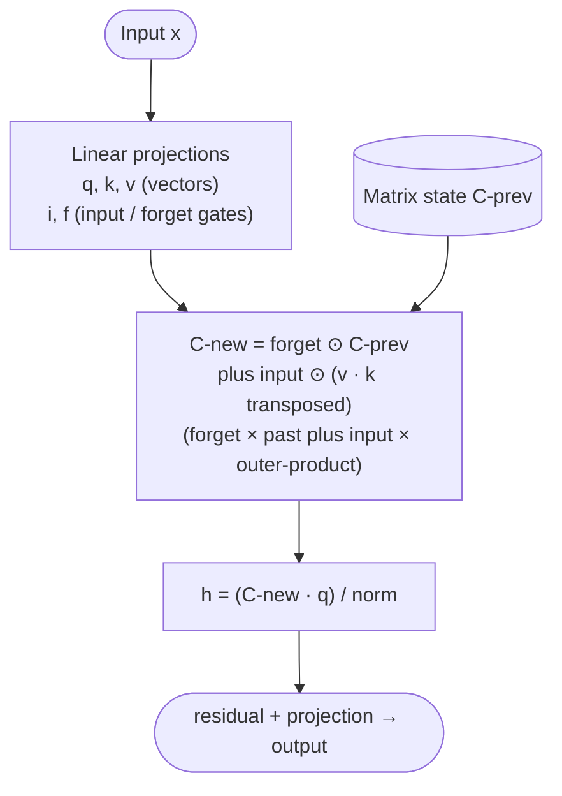

# xLSTM — Architecture

## Identity

xLSTM (**NX-AI, March 17, 2025**) is a **recurrent, non-transformer 7B LLM** based on a modernized **LSTM** (Long Short-Term Memory) cell. Developed by Sepp Hochreiter (the original co-inventor of LSTM in 1997) and his team. The xLSTM 7B is the most credible non-transformer / non-SSM LLM at meaningful scale, competing with Mamba on the "alternatives to attention" question.

| Spec | xLSTM 7B |
|---|---|
| Released | 2025-03-17 |
| Organization | NX-AI |
| Parameters | 7B |
| Architecture | **Recurrent mLSTM** (no self-attention) |
| Norm | RMSNorm |
| FFN | SwiGLU-like |
| License | open weights |

## What's new in xLSTM

The original LSTM had three limitations vs transformers:
1. **Sequential training** — can't parallelize across positions like attention.
2. **Limited memory** — single hidden state vector.
3. **Quality gap** at scale.

xLSTM addresses each:
- **sLSTM (scalar LSTM)** — stabilized exponential gating; better gradient flow.
- **mLSTM (matrix LSTM)** — replaces vector hidden state with a *matrix* state, dramatically increasing capacity.
- **Parallel training** — mLSTM admits parallel scans similar to Mamba.
- **Block-stacked architecture** — interleaves sLSTM and mLSTM blocks.

## Block diagram (mLSTM block)

The **matrix outer-product update** $v_t k_t^T$ is the key trick — it expands hidden capacity from $O(d)$ to $O(d^2)$ while keeping the recurrence linear in time.

## Recipe summary

| Component | xLSTM 7B |
|---|---|
| Sequence mixer | **mLSTM** (matrix LSTM, no attention) |
| FFN | SwiGLU-like |
| Norm | RMSNorm |
| Position | none needed (recurrence carries position) |
| Block stack | sLSTM + mLSTM blocks |

## xLSTM vs Mamba

Both are non-transformer linear-time alternatives. Comparison:

| Aspect | Mamba | xLSTM |
|---|---|---|
| Roots | Selective State-Space Model | Modernized LSTM |
| Hidden state | Structured matrix from HiPPO | Matrix state (mLSTM) |
| Training parallelism | Parallel scan | Parallel scan |
| Gating | Input-dependent A, B, C | Exponential gating |
| Adoption | Wide (Nemotron, hybrids, Cartesia) | Smaller community |

## Why xLSTM matters

- **Hochreiter's name** — the LSTM inventor revisiting the architecture lends credibility.
- **Demonstrates LSTMs scale** — long held to top out around 1B parameters, xLSTM trains successfully at 7B.
- **Architectural diversity** — keeps the field from monocropping on attention/SSM.

## Connections

- [[State Space Models]] — broader linear-time-sequence family
- [[Mamba]] — main non-transformer competitor
- [[Sequence Modeling Evolution]] — synthesis on RNN → Transformer → revival
- [[Transformer]] — what xLSTM replaces
- [[RMSNorm]]
- [[LLM Architecture]] — hub
- [[LLM Architecture Landscape 2026]] — comparative synthesis
- [[2026-05-28-raschka-llm-architecture-gallery]] — source

## Open Questions

- Will xLSTM scale to 70B+ and remain competitive with transformers?
- Hybrid xLSTM + transformer architectures — possible / explored?
- Hardware kernel maturity vs Mamba.
